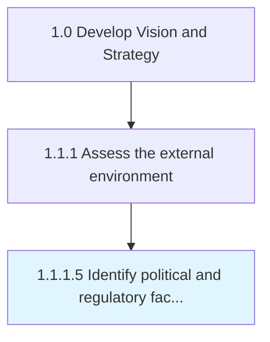

# Identify political and regulatory factors

> Identifying areas of concern pertaining to public policy and regulation, established by sovereign or multinational authorities.

## Overview

Activity 1.1.1.5 is an activity within the Develop Vision and Strategy framework. 

Identifying areas of concern pertaining to public policy and regulation, established by sovereign or multinational authorities. Examine various regions and geopolitical formations to identify those political and regulatory issues-present or developing-that can potentially affect the organization. Plan for an iterative process, partitioned across regional and geopolitical entities that have a direct bearing on the organization's activities. Assess changes in environmental compliance, product standards, trade barriers, etc.

## Process Hierarchy



## Key Statistics

| Metric | Value |
|--------|-------|
| APQC Code | 10023 |
| Hierarchy ID | 1.1.1.5 |
| Level | Activity |
| Parent | [1.1.1](../) |
| Sub-Processes | 0 |


## GraphDL Semantic Structure

```
identify.PoliticalAndRegulatoryFactors
```

| Component | Value | Description |
|-----------|-------|-------------|
| Verb | `identify` | Primary action |
| Object | `political and regulatory factors` | Direct object |


## Related Concepts

- PoliticalFactors
- RegulatoryFactors


---

*Source: APQC PCF 10023 (1.1.1.5) - APQC*
