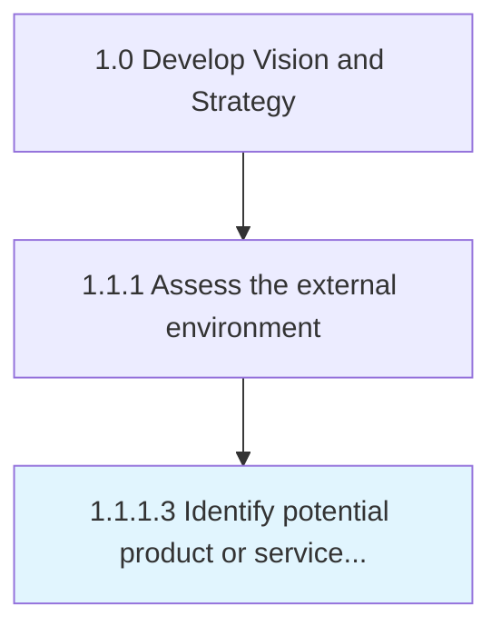

# Identify potential product or service alternatives

> Examining if there are other existing products or services in the marketplace, and building the business case to make a go/no go decision based upon substitutions.

## Overview

Activity 1.1.1.3 is an activity within the Develop Vision and Strategy framework. 

Examining if there are other existing products or services in the marketplace, and building the business case to make a go/no go decision based upon substitutions.

## Process Hierarchy



## Key Statistics

| Metric | Value |
|--------|-------|
| APQC Code | 21421 |
| Hierarchy ID | 1.1.1.3 |
| Level | Activity |
| Parent | [1.1.1](../) |
| Sub-Processes | 0 |


## GraphDL Semantic Structure

```
identify.PotentialProductOrServiceAlternatives
```

| Component | Value | Description |
|-----------|-------|-------------|
| Verb | `identify` | Primary action |
| Object | `potential product or service alternatives` | Direct object |


## Related Concepts

- PotentialProduct
- ServiceAlternatives


---

*Source: APQC PCF 21421 (1.1.1.3) - APQC*
