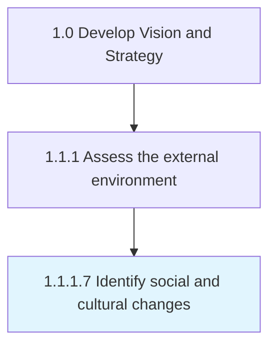

# Identify social and cultural changes

> Distinguishing changes in societal makeup, as well as the cultural composite.

## Overview

Activity 1.1.1.7 is an activity within the Develop Vision and Strategy framework. 

Distinguishing changes in societal makeup, as well as the cultural composite. Isolate shifts in the societal composition and distribution, as well as the value systems and attributes that bind the organization together. Analyze well-regarded publications--and gather the perspective of public intellectuals and opinion leaders--on relevant issues.

## Process Hierarchy



## Key Statistics

| Metric | Value |
|--------|-------|
| APQC Code | 10026 |
| Hierarchy ID | 1.1.1.7 |
| Level | Activity |
| Parent | [1.1.1](../) |
| Sub-Processes | 0 |


## GraphDL Semantic Structure

```
identify.SocialAndCulturalChanges
```

| Component | Value | Description |
|-----------|-------|-------------|
| Verb | `identify` | Primary action |
| Object | `social and cultural changes` | Direct object |


## Related Concepts

- [Social](/concepts/Social)
- [CulturalChanges](/concepts/CulturalChanges)


---

*Source: APQC PCF 10026 (1.1.1.7) - APQC*
