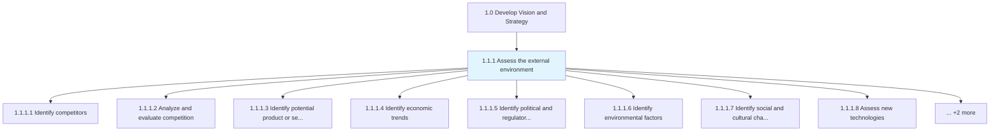
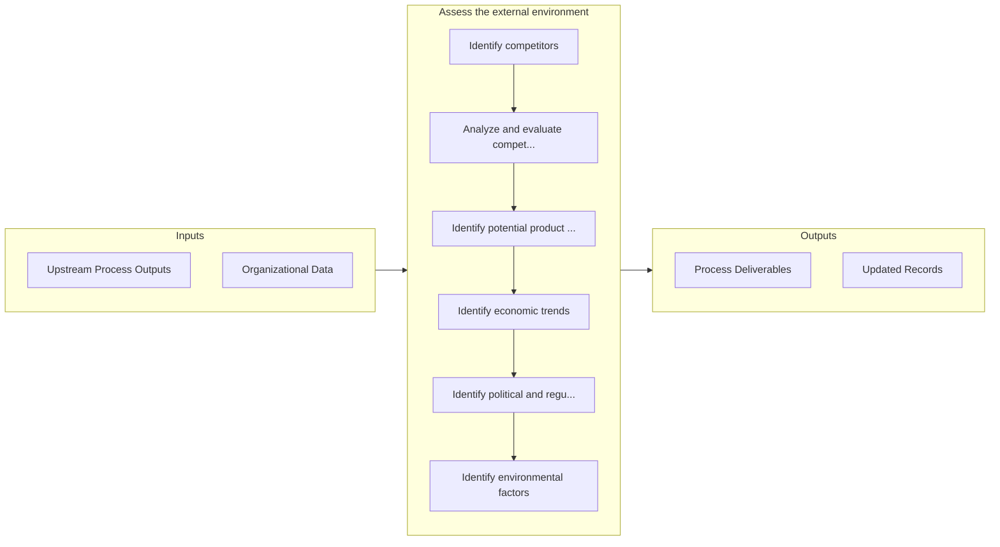

# Assess the external environment

> Assessing all forces, entities, and systems that are external to an organization but can affect its operation.

## Overview

Process 1.1.1 is a core process that defines the specific procedures for assess the external environment. 

Assessing all forces, entities, and systems that are external to an organization but can affect its operation. Analyze far-reaching currents in the macroeconomic situation, assess the competition, evaluate technological changes, and identify societal as well as ecological issues of concern. Create a big-picture understanding of externalities, with sufficient depth across individual aspects.

## Process Hierarchy



## Key Statistics

| Metric | Value |
|--------|-------|
| APQC Code | 10017 |
| Hierarchy ID | 1.1.1 |
| Level | Process |
| Parent | [1.1](../) |
| Sub-Processes | 10 |


## GraphDL Semantic Structure

```graphdl
assess.TheExternalEnvironment
```

| Component | Value | Description |
|-----------|-------|-------------|
| Verb | `assess` | Primary action |
| Object | `the external environment` | Direct object |


## Process Flow



## Sub-Processes

| Process | Hierarchy ID | Description |
|---------|-------------|-------------|
| [Identify competitors](./IdentifyCompetitors) | 1.1.1.1 | Identifying your competitors, their service and/or product |
| [Analyze and evaluate competition](./AnalyzeAndEvaluateCompetition) | 1.1.1.2 | Assessing the competitive forces in the marketplace that could potentially affect the organization |
| [Identify potential product or service alternatives](./IdentifyPotentialProductOrServiceAlternatives) | 1.1.1.3 | Examining if there are other existing products or services in the marketplace, and building the busi |
| [Identify economic trends](./IdentifyEconomicTrends) | 1.1.1.4 | Determining large-scale macroeconomic shifts and trends, with medium to long-term relevance for the  |
| [Identify political and regulatory factors](./IdentifyPoliticalAndRegulatoryFactors) | 1.1.1.5 | Identifying areas of concern pertaining to public policy and regulation, established by sovereign or |
| [Identify environmental factors](./IdentifyEnvironmentalFactors) | 1.1.1.6 | Identifying changes in ecological ecosystems that can be directly or indirectly detrimental to the o |
| [Identify social and cultural changes](./IdentifySocialAndCulturalChanges) | 1.1.1.7 | Distinguishing changes in societal makeup, as well as the cultural composite |
| [Assess new technologies](./AssessNewTechnologies) | 1.1.1.8 | Assessing developments in technologies presently being used by the business, new technologies that h |
| [Analyze demographics](./AnalyzeDemographics) | 1.1.1.9 | Analyzing statistical data relating to the size, distribution, and composition of relevant populatio |
| [Evaluate intellectual property](./EvaluateIntellectualProperty) | 1.1.1.10 | Establishing measures and procedures for identifying various intellectual property threats and conce |


## Related Concepts

- ExternalEnvironment


---

*Source: APQC PCF 10017 (1.1.1) - APQC*
