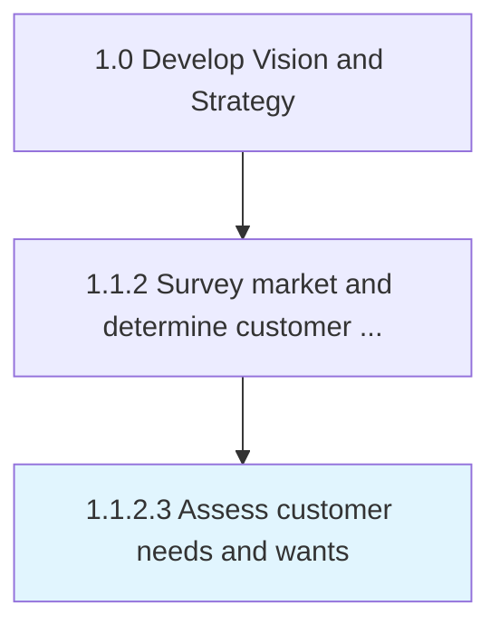

# Assess customer needs and wants

> Creating customer profiles to get a picture of customers and their needs.

## Overview

Activity 1.1.2.3 is an activity within the Develop Vision and Strategy framework. 

Creating customer profiles to get a picture of customers and their needs. Identify particular groups of people/organizations that benefit from your product/services and then selling to them.

## Process Hierarchy



## Key Statistics

| Metric | Value |
|--------|-------|
| APQC Code | 19947 |
| Hierarchy ID | 1.1.2.3 |
| Level | Activity |
| Parent | [1.1.2](../) |
| Sub-Processes | 0 |


## GraphDL Semantic Structure

```
assess.CustomerNeedsAndWants
```

| Component | Value | Description |
|-----------|-------|-------------|
| Verb | `assess` | Primary action |
| Object | `customer needs and wants` | Direct object |


## Related Concepts

- [CustomerNeeds](/concepts/CustomerNeeds)
- [Wants](/concepts/Wants)


---

*Source: APQC PCF 19947 (1.1.2.3) - APQC*
