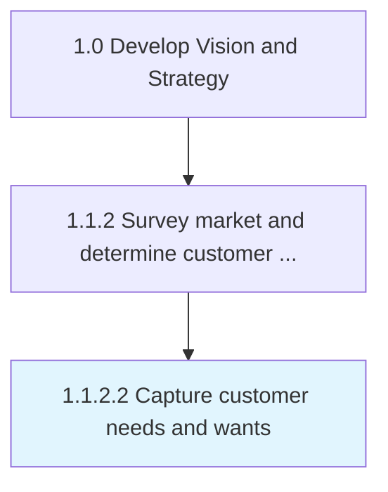

# Capture customer needs and wants

> Identifying and collecting customers' wants and needs of a product and/or services from a marketing perspective.

## Overview

Activity 1.1.2.2 is an activity within the Develop Vision and Strategy framework. 

Identifying and collecting customers' wants and needs of a product and/or services from a marketing perspective. Identify which consumer needs are important and whether needs are being met by current products/services.

## Process Hierarchy



## Key Statistics

| Metric | Value |
|--------|-------|
| APQC Code | 19946 |
| Hierarchy ID | 1.1.2.2 |
| Level | Activity |
| Parent | [1.1.2](../) |
| Sub-Processes | 0 |


## GraphDL Semantic Structure

```
capture.CustomerNeedsAndWants
```

| Component | Value | Description |
|-----------|-------|-------------|
| Verb | `capture` | Primary action |
| Object | `customer needs and wants` | Direct object |


## Related Concepts

- CustomerNeeds
- Wants


---

*Source: APQC PCF 19946 (1.1.2.2) - APQC*
