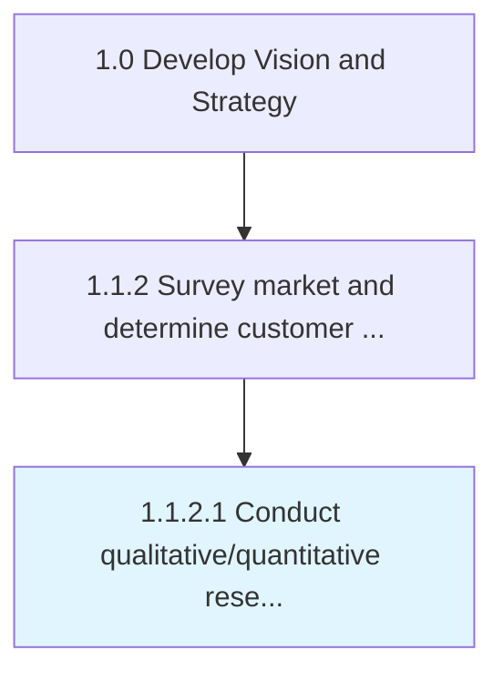
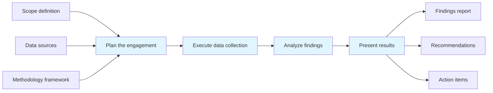
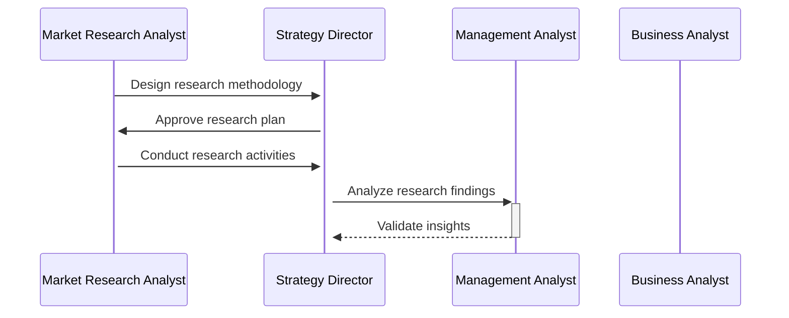

# Conduct qualitative/quantitative research and assessments

> Investigating key market features and customer characteristics, using qualitative and quantitative measures to capture relevant aspects.

## Overview

Activity 1.1.2.1 is an activity within the Develop Vision and Strategy framework. 

Investigating key market features and customer characteristics, using qualitative and quantitative measures to capture relevant aspects. Distill key ingredients that allow the organization to Capture customer needs and wants [19946], and Assess customer needs and wants [19947]. Conduct standardized appraisals by defining selection parameters and setting quotas.

This process plays a critical role within the broader "Develop Vision and Strategy" capability area (APQC Category 1.0). By systematically executing this activity, organizations ensure that strategic decisions are grounded in thorough analysis and aligned with overall business objectives. The outputs of this process feed into downstream strategy development and execution activities, creating a foundation for informed decision-making across the enterprise.

## Process Hierarchy



## Key Statistics

| Metric | Value |
|--------|-------|
| APQC Code | 10028 |
| Hierarchy ID | 1.1.2.1 |
| Level | Activity |
| Parent | [1.1.2](../) |
| Sub-Processes | 0 |
| Estimated Duration | 1-4 weeks |
| Complexity | Medium |

## GraphDL Semantic Structure

```graphdl
conduct.QualitativequantitativeResearchAndAssessments
```

| Component | Value | Description |
|-----------|-------|-------------|
| Verb | `conduct` | Primary action |
| Object | `qualitative/quantitative research and assessments` | Direct object |

## Process Flow



## Process Sequence



## RACI Matrix

| Activity | Responsible | Accountable | Consulted | Informed |
|----------|-------------|-------------|-----------|----------|
| Gather data and intelligence | Market Research Analyst | Strategy Director | Business Unit Leaders | Executive Team |
| Conduct analysis | Management Analyst | Strategy Director | Subject Matter Experts | Department Heads |
| Document findings | Business Analyst | Strategy Director | Market Research Team | Stakeholders |
| Present to leadership | Strategy Director | Chief Strategy Officer | Executive Sponsors | Board of Directors |

## Related Occupations

| Occupation | Role in Process |
|------------|----------------|
| [Chief Executives](/occupations/Management/ChiefExecutives) | Primary strategic oversight and decision authority |
| [Market Research Analysts](/occupations/MarketResearchAnalysts) | Executes analysis and produces deliverables |
| [Management Analysts](/occupations/Business/Operations/ManagementAnalysts) | Provides analytical frameworks and recommendations |
| [Business Intelligence Analysts](/occupations/Technology/BusinessIntelligenceAnalysts) | Supports data gathering and insight generation |
| [Strategic Planners](/occupations/StrategicPlanners) | Coordinates strategic alignment and planning |

## Related Departments

| Department | Involvement |
|------------|-------------|
| Strategy & Planning | Primary owner and executor of this process |
| Market Research | Provides supporting data, resources, and coordination |
| Executive Leadership | Provides governance, approval, and strategic direction |

## Industry Variations

| Industry | Variation | Reference |
|----------|-----------|-----------|
| Manufacturing | Emphasizes supply chain and operational efficiency metrics in strategic planning | [manufacturing](/industries/manufacturing) |
| Financial Services | Focuses on regulatory compliance and risk management within strategy processes | [banking](/industries/banking) |
| Technology | Prioritizes innovation velocity and digital transformation in strategic initiatives | [consumer-electronics](/industries/consumer-electronics) |

## KPIs & Metrics

| KPI | Description | Target |
|-----|-------------|--------|
| Process Completion Rate | Percentage of process completed on schedule | > 95% |
| Stakeholder Satisfaction | Average satisfaction rating from involved parties | > 4.0/5.0 |
| Output Quality Score | Quality assessment of process deliverables | > 80% |

## Related Concepts

- QualitativeResearch
- QuantitativeResearch
- Assessments

---

*Source: APQC PCF 10028 (1.1.2.1) - APQC*
