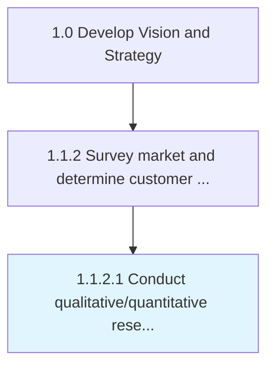

# Conduct qualitative/quantitative research and assessments

> Investigating key market features and customer characteristics, using qualitative and quantitative measures to capture relevant aspects.

## Overview

Activity 1.1.2.1 is an activity within the Develop Vision and Strategy framework. 

Investigating key market features and customer characteristics, using qualitative and quantitative measures to capture relevant aspects. Distill key ingredients that allow the organization to Capture customer needs and wants [19946], and Assess customer needs and wants [19947]. Conduct standardized appraisals by defining selection parameters and setting quotas.

## Process Hierarchy



## Key Statistics

| Metric | Value |
|--------|-------|
| APQC Code | 10028 |
| Hierarchy ID | 1.1.2.1 |
| Level | Activity |
| Parent | [1.1.2](../) |
| Sub-Processes | 0 |


## GraphDL Semantic Structure

```
conduct.QualitativequantitativeResearchAndAssessments
```

| Component | Value | Description |
|-----------|-------|-------------|
| Verb | `conduct` | Primary action |
| Object | `qualitative/quantitative research and assessments` | Direct object |


## Related Concepts

- QualitativeResearch
- QuantitativeResearch
- Assessments


---

*Source: APQC PCF 10028 (1.1.2.1) - APQC*
