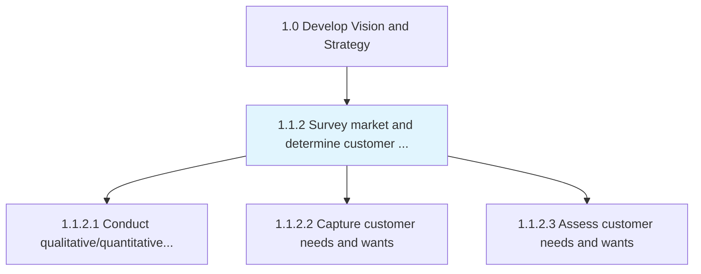
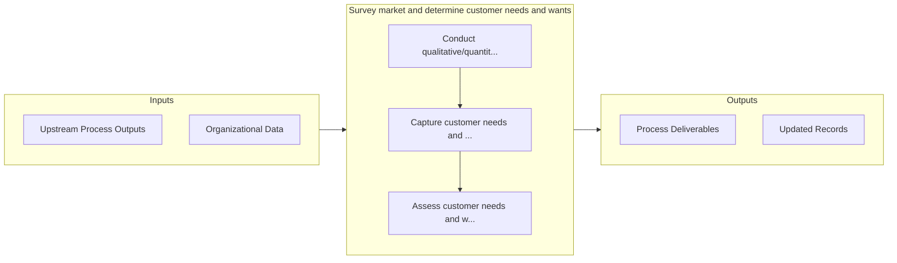

# Survey market and determine customer needs and wants

> Examining the market to identify customer required solutions.

## Overview

Process 1.1.2 is a core process that defines the specific procedures for survey market and determine customer needs and wants. 

Examining the market to identify customer required solutions. Assess the relevant market(s) to determine the products/services that are needed or wanted by customers. Carry out quantitative and qualitative analyses to capture and investigate products/services. Employ creative techniques that allow for a closer appreciation of the customer, and design relevant solutions.

## Process Hierarchy



## Key Statistics

| Metric | Value |
|--------|-------|
| APQC Code | 10018 |
| Hierarchy ID | 1.1.2 |
| Level | Process |
| Parent | [1.1](../) |
| Sub-Processes | 3 |


## GraphDL Semantic Structure

```
survey.MarketAndDetermineCustomerNeedsAndWants
```

| Component | Value | Description |
|-----------|-------|-------------|
| Verb | `survey` | Primary action |
| Object | `market and determine customer needs and wants` | Direct object |


## Process Flow



## Sub-Processes

| Process | Hierarchy ID | Description |
|---------|-------------|-------------|
| [Conduct qualitative/quantitative research and assessments](./ConductQualitativequantitativeResearchAndAssessments) | 1.1.2.1 | Investigating key market features and customer characteristics, using qualitative and quantitative m |
| [Capture customer needs and wants](./CaptureCustomerNeedsAndWants) | 1.1.2.2 | Identifying and collecting customers' wants and needs of a product and/or services from a marketing  |
| [Assess customer needs and wants](./AssessCustomerNeedsAndWants) | 1.1.2.3 | Creating customer profiles to get a picture of customers and their needs |


## Related Concepts

- MarketCustomerNeeds
- Wants
- DetermineCustomerNeeds
- Wants


---

*Source: APQC PCF 10018 (1.1.2) - APQC*
