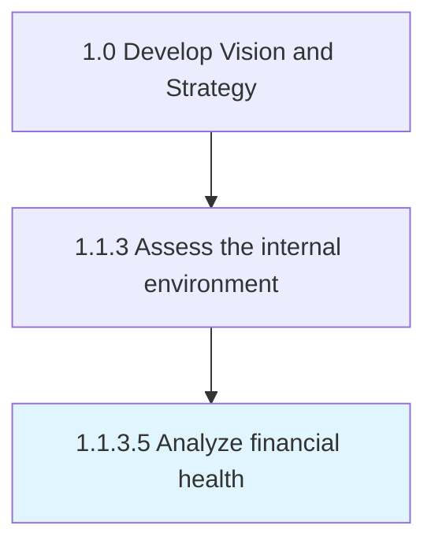

# Analyze financial health

> Appraising the financial state of the organization so that management can create resource allocation strategies.

## Overview

Activity 1.1.3.5 is an activity within the Develop Vision and Strategy framework. 

Appraising the financial state of the organization so that management can create resource allocation strategies. Scrutinize the organization's financials--including balance sheets, statements of income, cash-flows, equity holdings, and liquidity--with the objective of understanding the organization's financial health and capacities. (This analysis directly feeds into Conduct organizational restructuring opportunities [16792] and Define a business concept and long-term vision [17040].)

## Process Hierarchy



## Key Statistics

| Metric | Value |
|--------|-------|
| APQC Code | 10033 |
| Hierarchy ID | 1.1.3.5 |
| Level | Activity |
| Parent | [1.1.3](../) |
| Sub-Processes | 0 |


## GraphDL Semantic Structure

```
analyze.FinancialHealth
```

| Component | Value | Description |
|-----------|-------|-------------|
| Verb | `analyze` | Primary action |
| Object | `financial health` | Direct object |


## Related Concepts

- [FinancialHealth](/concepts/FinancialHealth)


---

*Source: APQC PCF 10033 (1.1.3.5) - APQC*
