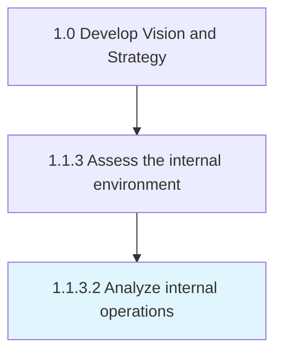

# Analyze internal operations

> Identify key elements of operations and measure effectiveness of these elements within internal operations.

## Overview

Activity 1.1.3.2 is an activity within the Develop Vision and Strategy framework. 

Identify key elements of operations and measure effectiveness of these elements within internal operations.

## Process Hierarchy



## Key Statistics

| Metric | Value |
|--------|-------|
| APQC Code | 19948 |
| Hierarchy ID | 1.1.3.2 |
| Level | Activity |
| Parent | [1.1.3](../) |
| Sub-Processes | 0 |


## GraphDL Semantic Structure

```
analyze.InternalOperations
```

| Component | Value | Description |
|-----------|-------|-------------|
| Verb | `analyze` | Primary action |
| Object | `internal operations` | Direct object |


## Related Concepts

- InternalOperations


---

*Source: APQC PCF 19948 (1.1.3.2) - APQC*
