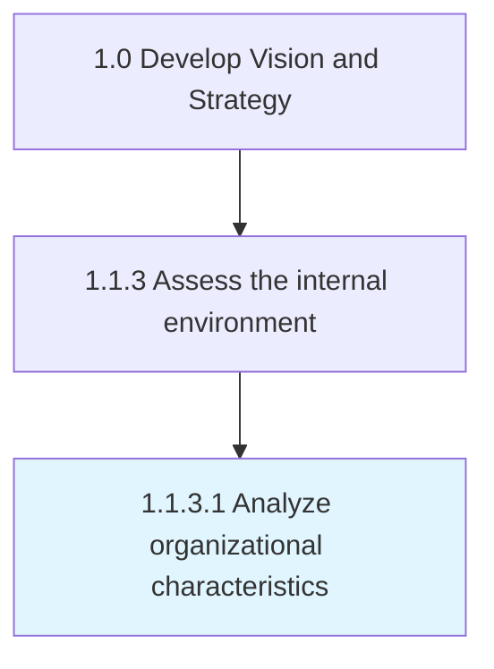

# Analyze organizational characteristics

> Identifying and examining key attributes that differentiate the organization in the market and those that underscore the core of its operations.

## Overview

Activity 1.1.3.1 is an activity within the Develop Vision and Strategy framework. 

Identifying and examining key attributes that differentiate the organization in the market and those that underscore the core of its operations. Consider how the organization functions. Reflect over tangible and intangible aspects in order to spot critical correlations and the interplay between these attributes. Have senior executives conduct the analysis, with input from management and operational personnel.

## Process Hierarchy



## Key Statistics

| Metric | Value |
|--------|-------|
| APQC Code | 10030 |
| Hierarchy ID | 1.1.3.1 |
| Level | Activity |
| Parent | [1.1.3](../) |
| Sub-Processes | 0 |


## GraphDL Semantic Structure

```
analyze.OrganizationalCharacteristics
```

| Component | Value | Description |
|-----------|-------|-------------|
| Verb | `analyze` | Primary action |
| Object | `organizational characteristics` | Direct object |


## Related Concepts

- OrganizationalCharacteristics


---

*Source: APQC PCF 10030 (1.1.3.1) - APQC*
