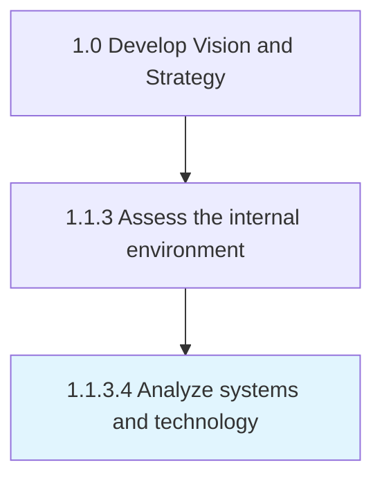

# Analyze systems and technology

> Analyzing the capabilities of technology and process automation systems deployed within the organization in order to direct future associated processes.

## Overview

Activity 1.1.3.4 is an activity within the Develop Vision and Strategy framework. 

Analyzing the capabilities of technology and process automation systems deployed within the organization in order to direct future associated processes. Conduct a broad-based survey to examine various aspects associated with such systems and technologies, with the objective of identifying key facets that are of interest. Investigate the intended purpose, purpose served, utility, longevity, remaining service-life, repair or service requirements, etc.

## Process Hierarchy



## Key Statistics

| Metric | Value |
|--------|-------|
| APQC Code | 10032 |
| Hierarchy ID | 1.1.3.4 |
| Level | Activity |
| Parent | [1.1.3](../) |
| Sub-Processes | 0 |


## GraphDL Semantic Structure

```
analyze.SystemsAndTechnology
```

| Component | Value | Description |
|-----------|-------|-------------|
| Verb | `analyze` | Primary action |
| Object | `systems and technology` | Direct object |


## Related Concepts

- [Systems](/concepts/Systems)
- [Technology](/concepts/Technology)


---

*Source: APQC PCF 10032 (1.1.3.4) - APQC*
