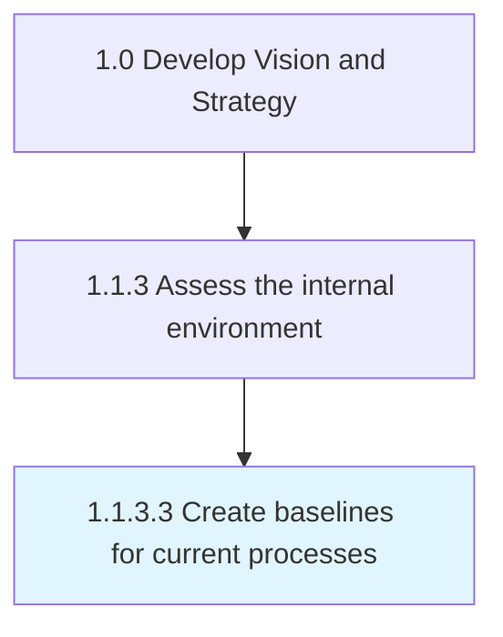

# Create baselines for current processes

> Establishing baselines that provide standards for assessing performance levels and allow for a relational benchmarking of current processes.

## Overview

Activity 1.1.3.3 is an activity within the Develop Vision and Strategy framework. 

Establishing baselines that provide standards for assessing performance levels and allow for a relational benchmarking of current processes. Undertake a survey of archival performance records, conducted in conjunction by the management and the operations personnel. Take into account the organization's internal objectives, particularly for process improvement and enhancement. Understand industry best practices.

## Process Hierarchy



## Key Statistics

| Metric | Value |
|--------|-------|
| APQC Code | 10031 |
| Hierarchy ID | 1.1.3.3 |
| Level | Activity |
| Parent | [1.1.3](../) |
| Sub-Processes | 0 |


## GraphDL Semantic Structure

```
create.Baselines.for.CurrentProcesses
```

| Component | Value | Description |
|-----------|-------|-------------|
| Verb | `create` | Primary action |
| Object | `baselines` | Direct object |
| Preposition | `for` | Relationship |
| PrepObject | `current processes` | Indirect object |


## Related Concepts

- [Baselines](/concepts/Baselines)
- [CurrentProcesses](/concepts/CurrentProcesses)


---

*Source: APQC PCF 10031 (1.1.3.3) - APQC*
