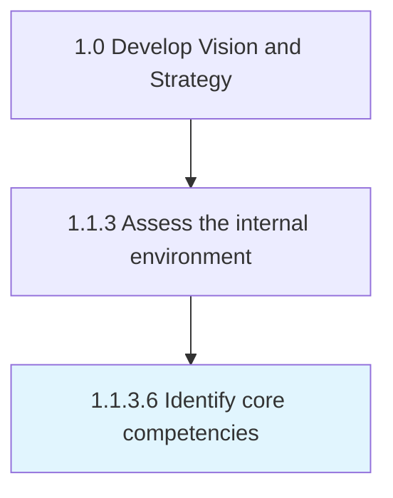

# Identify core competencies

> Determining a strategically significant aggregate of competence and capacities that differentiates the organization in the market.

## Overview

Activity 1.1.3.6 is an activity within the Develop Vision and Strategy framework. 

Determining a strategically significant aggregate of competence and capacities that differentiates the organization in the market. Identify distinguishing attributes including unique skills and resources and its brand and services in the marketplace. Have senior executives and management personnel assess competencies in order to further develop these capabilities into distinct commercial value propositions.

## Process Hierarchy



## Key Statistics

| Metric | Value |
|--------|-------|
| APQC Code | 10034 |
| Hierarchy ID | 1.1.3.6 |
| Level | Activity |
| Parent | [1.1.3](../) |
| Sub-Processes | 0 |


## GraphDL Semantic Structure

```
identify.CoreCompetencies
```

| Component | Value | Description |
|-----------|-------|-------------|
| Verb | `identify` | Primary action |
| Object | `core competencies` | Direct object |


## Related Concepts

- CoreCompetencies


---

*Source: APQC PCF 10034 (1.1.3.6) - APQC*
