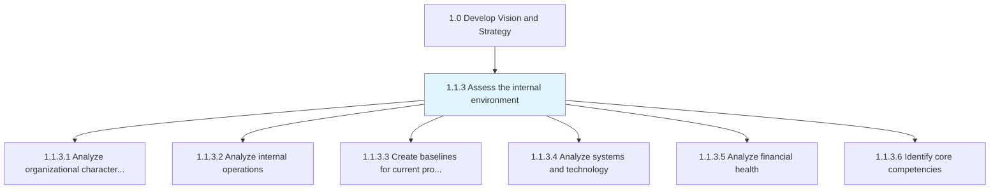
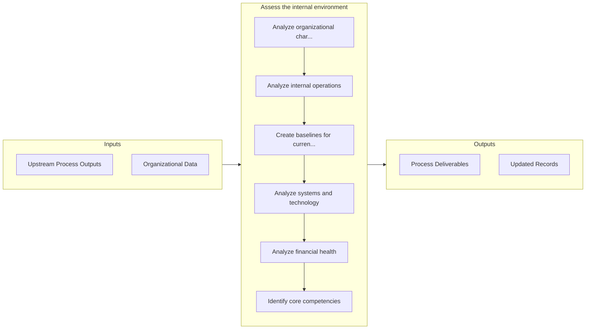

# Assess the internal environment

> Undertaking a review of the organization's in-house skills and resources in order to create a big-picture understanding of internal capacities.

## Overview

Process 1.1.3 is a core process that defines the specific procedures for assess the internal environment. 

Undertaking a review of the organization's in-house skills and resources in order to create a big-picture understanding of internal capacities. Assess the organization's capabilities in order to advance the advantageous and weed out the detrimental aspects. Identify synergic associations within the backdrop of the forces and players active in the market, and take into account all externalities.

## Process Hierarchy



## Key Statistics

| Metric | Value |
|--------|-------|
| APQC Code | 10019 |
| Hierarchy ID | 1.1.3 |
| Level | Process |
| Parent | [1.1](../) |
| Sub-Processes | 6 |


## GraphDL Semantic Structure

```graphdl
assess.TheInternalEnvironment
```

| Component | Value | Description |
|-----------|-------|-------------|
| Verb | `assess` | Primary action |
| Object | `the internal environment` | Direct object |


## Process Flow



## Sub-Processes

| Process | Hierarchy ID | Description |
|---------|-------------|-------------|
| [Analyze organizational characteristics](./AnalyzeOrganizationalCharacteristics) | 1.1.3.1 | Identifying and examining key attributes that differentiate the organization in the market and those |
| [Analyze internal operations](./AnalyzeInternalOperations) | 1.1.3.2 | Identify key elements of operations and measure effectiveness of these elements within internal oper |
| [Create baselines for current processes](./CreateBaselinesForCurrentProcesses) | 1.1.3.3 | Establishing baselines that provide standards for assessing performance levels and allow for a relat |
| [Analyze systems and technology](./AnalyzeSystemsAndTechnology) | 1.1.3.4 | Analyzing the capabilities of technology and process automation systems deployed within the organiza |
| [Analyze financial health](./AnalyzeFinancialHealth) | 1.1.3.5 | Appraising the financial state of the organization so that management can create resource allocation |
| [Identify core competencies](./IdentifyCoreCompetencies) | 1.1.3.6 | Determining a strategically significant aggregate of competence and capacities that differentiates t |


## Related Concepts

- InternalEnvironment


---

*Source: APQC PCF 10019 (1.1.3) - APQC*
