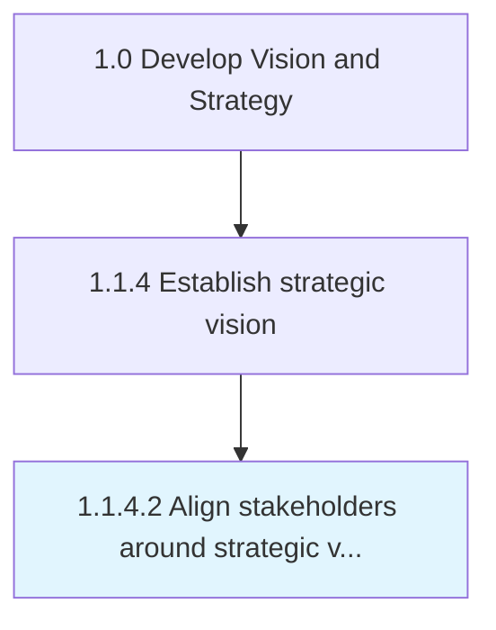

# Align stakeholders around strategic vision

> Orienting those entities, associated with the organization that have a direct bearing on its operations and output, in a way that advances its strategic vision.

## Overview

Activity 1.1.4.2 is an activity within the Develop Vision and Strategy framework. 

Orienting those entities, associated with the organization that have a direct bearing on its operations and output, in a way that advances its strategic vision. Map all stakeholders in strategic configurations, within the architectural layout of the marketplace, and position the organization relative to them. (This exercise is undertaken by senior strategy personnel, drawing upon the process Define a business concept and long-term vision [17040].)

## Process Hierarchy



## Key Statistics

| Metric | Value |
|--------|-------|
| APQC Code | 10035 |
| Hierarchy ID | 1.1.4.2 |
| Level | Activity |
| Parent | [1.1.4](../) |
| Sub-Processes | 0 |


## GraphDL Semantic Structure

```
align.Stakeholders.around.StrategicVision
```

| Component | Value | Description |
|-----------|-------|-------------|
| Verb | `align` | Primary action |
| Object | `stakeholders` | Direct object |
| Preposition | `around` | Relationship |
| PrepObject | `strategic vision` | Indirect object |


## Related Concepts

- Stakeholders
- StrategicVision


---

*Source: APQC PCF 10035 (1.1.4.2) - APQC*
