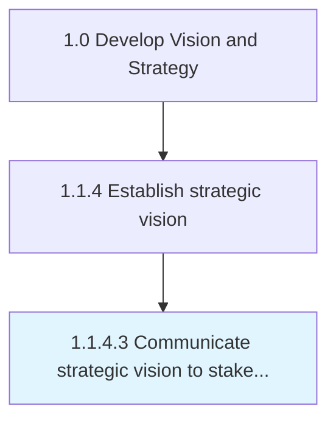

# Communicate strategic vision to stakeholders

> Developing and executing communication strategies to convey an alignment plan of all organizational stakeholders, which helps the organization realize its vision.

## Overview

Activity 1.1.4.3 is an activity within the Develop Vision and Strategy framework. 

Developing and executing communication strategies to convey an alignment plan of all organizational stakeholders, which helps the organization realize its vision. Create custom communication strategies and delivery channels with the objective of orienting stakeholders according to the configuration maps created in the process Align stakeholders around a strategic vision [10035]. Have senior strategy personnel closely collaborate with the communications/marketing team.

## Process Hierarchy



## Key Statistics

| Metric | Value |
|--------|-------|
| APQC Code | 10036 |
| Hierarchy ID | 1.1.4.3 |
| Level | Activity |
| Parent | [1.1.4](../) |
| Sub-Processes | 0 |


## GraphDL Semantic Structure

```
communicate.StrategicVision.to.Stakeholders
```

| Component | Value | Description |
|-----------|-------|-------------|
| Verb | `communicate` | Primary action |
| Object | `strategic vision` | Direct object |
| Preposition | `to` | Relationship |
| PrepObject | `stakeholders` | Indirect object |


## Related Concepts

- [StrategicVision](/concepts/StrategicVision)
- [Stakeholders](/concepts/Stakeholders)


---

*Source: APQC PCF 10036 (1.1.4.3) - APQC*
