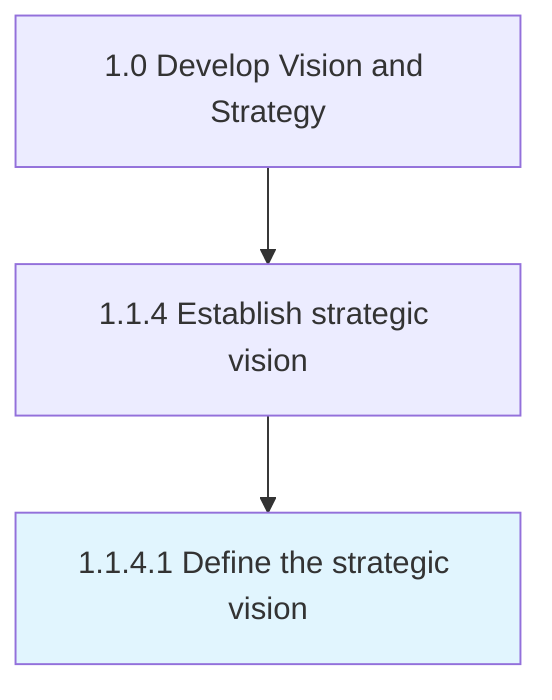

# Define the strategic vision

> Developing goals to define organizations vision.

## Overview

Activity 1.1.4.1 is an activity within the Develop Vision and Strategy framework. 

Developing goals to define organizations vision. Define and document ideas, direction, and activities which enable the organization to reach these goals.

## Process Hierarchy



## Key Statistics

| Metric | Value |
|--------|-------|
| APQC Code | 19949 |
| Hierarchy ID | 1.1.4.1 |
| Level | Activity |
| Parent | [1.1.4](../) |
| Sub-Processes | 0 |


## GraphDL Semantic Structure

```
define.TheStrategicVision
```

| Component | Value | Description |
|-----------|-------|-------------|
| Verb | `define` | Primary action |
| Object | `the strategic vision` | Direct object |


## Related Concepts

- StrategicVision


---

*Source: APQC PCF 19949 (1.1.4.1) - APQC*
