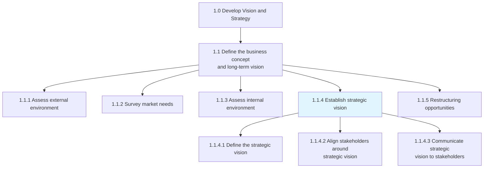
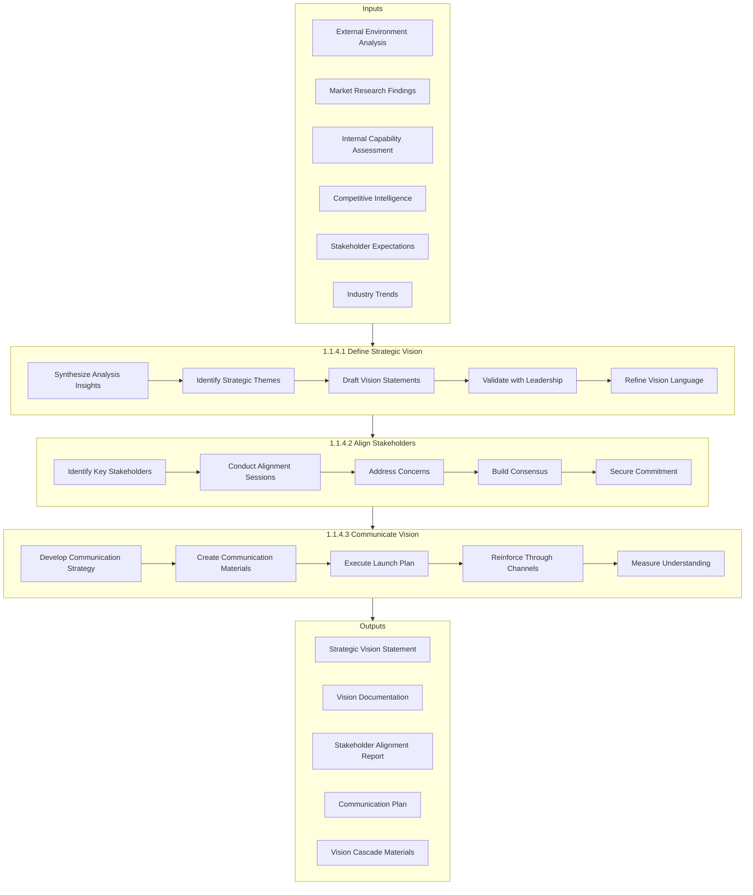
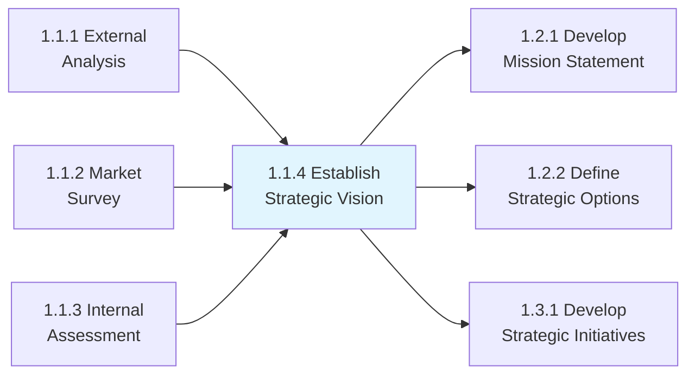

# Establish strategic vision

> Establishing the organization's long-term vision as a strategic positioning and engagement of stakeholders.

## Overview

Process 1.1.4 - Establish Strategic Vision is a pivotal process within the business concept development group. This process transforms insights from environmental analysis and market research into a compelling, actionable vision that guides organizational direction for 3-10 years.

The strategic vision serves as the North Star for all organizational activities, providing clarity on where the organization aspires to be and what it aims to achieve. This process involves not just articulating the vision but ensuring it resonates with and is embraced by all stakeholders, from the board and executives to front-line employees.

Effective vision establishment requires a balance between aspiration and achievability, innovation and pragmatism. The resulting vision statement should be memorable, inspiring, and specific enough to guide strategic decision-making while remaining flexible enough to accommodate market changes.

## Process Hierarchy



## Key Statistics

| Metric | Value |
|--------|-------|
| APQC Code | 10020 |
| Hierarchy ID | 1.1.4 |
| Level | Process |
| Parent | [1.1 Define Business Concept](../) |
| Child Activities | 3 |
| Typical Duration | 4-8 weeks |
| Revision Frequency | Every 3-5 years |

## GraphDL Semantic Structure

```graphdl
establish.StrategicVision
```

| Component | Value | Description |
|-----------|-------|-------------|
| Verb | `establish` | Creating and institutionalizing |
| Object | `StrategicVision` | Long-term organizational direction |
| Preposition | - | Not applicable |
| PrepObject | - | Not applicable |

## Process Flow



## Sub-Processes

### [1.1.4.1 Define the strategic vision](./DefineTheStrategicVision/)

Developing goals to define the organization's vision. Synthesize insights from environmental scanning, market research, and internal assessments to articulate a clear, compelling vision that describes the organization's desired future state.

**Key Activities:**
- Synthesize strategic analysis outputs
- Identify core strategic themes and priorities
- Draft and iterate vision statement language
- Validate vision with executive leadership
- Ensure vision aligns with organizational values

**APQC Code:** 10024 | **Typical Duration:** 2-3 weeks

### [1.1.4.2 Align stakeholders around strategic vision](./AlignStakeholdersAroundStrategicVision/)

Orienting entities associated with the organization that have a direct bearing on its operation. Engage board members, executives, management, employees, investors, and key partners to ensure understanding and commitment to the strategic vision.

**Key Activities:**
- Map stakeholder groups and their interests
- Design alignment workshops and sessions
- Facilitate vision alignment discussions
- Address objections and concerns
- Document stakeholder commitments

**APQC Code:** 10025 | **Typical Duration:** 2-4 weeks

### [1.1.4.3 Communicate strategic vision to stakeholders](./CommunicateStrategicVisionToStakeholders/)

Developing and executing communication strategies to convey an alignment plan of all organizational stakeholders. Create a comprehensive communication plan that ensures the vision is understood, embraced, and actionable across all levels.

**Key Activities:**
- Develop multi-channel communication strategy
- Create tailored messaging for different audiences
- Execute coordinated launch campaign
- Establish ongoing reinforcement mechanisms
- Monitor and measure communication effectiveness

**APQC Code:** 10026 | **Typical Duration:** 2-4 weeks (initial), ongoing

## RACI Matrix

| Activity | Responsible | Accountable | Consulted | Informed |
|----------|-------------|-------------|-----------|----------|
| Define strategic vision | Strategy Team | CEO | Board, Executives | All Managers |
| Draft vision statement | CSO/Strategy Lead | CEO | CMO, CHRO | Senior Leadership |
| Validate with leadership | CEO | Board Chair | Executive Committee | Investors |
| Align stakeholders | Executive Team | CEO | All Leaders | All Employees |
| Facilitate alignment sessions | HR/Strategy | COO | Department Heads | Teams |
| Develop communication plan | Corporate Communications | CMO | HR, Strategy | All |
| Execute vision launch | Communications Team | CMO | All Departments | All Stakeholders |
| Measure understanding | HR/Communications | CHRO | Managers | Leadership |

## Metrics & KPIs

| Metric | Description | Target | Frequency |
|--------|-------------|--------|-----------|
| Vision Awareness | Percentage of employees who can articulate the vision | >90% | Quarterly |
| Vision Alignment Score | Stakeholder agreement with vision direction | >85% | Annual |
| Vision Comprehension | Understanding of vision implications for role | >80% | Bi-annual |
| Leadership Alignment | Executive team alignment on vision | 100% | Quarterly |
| Vision Consistency | Consistency of vision messaging across channels | >95% | Monthly |
| Time to Alignment | Duration from vision draft to stakeholder alignment | <6 weeks | Per cycle |
| Communication Reach | Percentage of stakeholders receiving vision communication | 100% | Per launch |

## Related Departments

| Department | Role in Strategic Vision |
|------------|-------------------------|
| Executive Office | Vision ownership and accountability |
| Strategy & Planning | Vision development and facilitation |
| Corporate Communications | Vision communication and messaging |
| Human Resources | Stakeholder engagement and culture alignment |
| Marketing | External vision communication |
| All Business Units | Vision adoption and cascade |

## Related Occupations

- [Chief Executive Officers](/occupations/Management/ChiefExecutives) - Vision accountability and sponsorship
- [Chief Strategy Officers](/occupations/Management/StrategyOfficers) - Vision development leadership
- [Chief Human Resources Officers](/occupations/Management/HRManagers) - Stakeholder alignment
- [Corporate Communications Directors](/occupations/Management/PRManagers) - Vision communication
- [Strategic Planners](/occupations/Business/StrategicPlanners) - Vision process facilitation
- [Change Management Specialists](/occupations/Business/ManagementAnalysts) - Adoption and alignment

## Industry Variations

### Technology Companies
Vision focused on innovation, disruption, and market creation. Shorter revision cycles (2-3 years) due to rapid market changes. Emphasis on technical differentiation and platform ecosystem.

### Healthcare Providers
Patient-centered vision emphasizing quality, access, and outcomes. Vision must address regulatory requirements and community health needs. Extended stakeholder group includes medical staff and community.

### Financial Services
Vision addressing trust, security, and digital transformation. Heavy emphasis on regulatory compliance and risk management. Stakeholder alignment includes regulators and rating agencies.

### Manufacturing
Vision centered on operational excellence, quality, and sustainability. Long planning horizons aligned with capital investment cycles. Supply chain and partner alignment critical.

### Non-Profit Organizations
Mission-driven vision with emphasis on social impact. Donor and volunteer stakeholder alignment essential. Board governance plays elevated role in vision definition.

## Best Practices

### Vision Statement Characteristics
- **Aspirational**: Inspires and motivates stakeholders
- **Clear**: Easily understood by all audiences
- **Concise**: Typically 1-2 sentences, memorable
- **Future-oriented**: Describes desired future state
- **Aligned**: Consistent with values and culture
- **Differentiated**: Distinguishes from competitors

### Stakeholder Alignment Approaches
- Executive workshops with structured dialogue
- Town halls and all-hands meetings
- Cascade sessions through management layers
- One-on-one conversations for key stakeholders
- Feedback mechanisms and listening sessions

### Communication Excellence
- Multi-channel approach (digital, print, in-person)
- Consistent messaging with tailored delivery
- Leadership role-modeling and reinforcement
- Regular touchpoints and reminders
- Success stories and examples

## Related Processes



## Related Concepts

- Strategic Vision
- Organizational Direction
- Stakeholder Alignment
- Vision Communication
- Strategic Positioning
- Long-term Planning

---

*Source: APQC PCF 10020 (1.1.4) - Cross-Industry*
