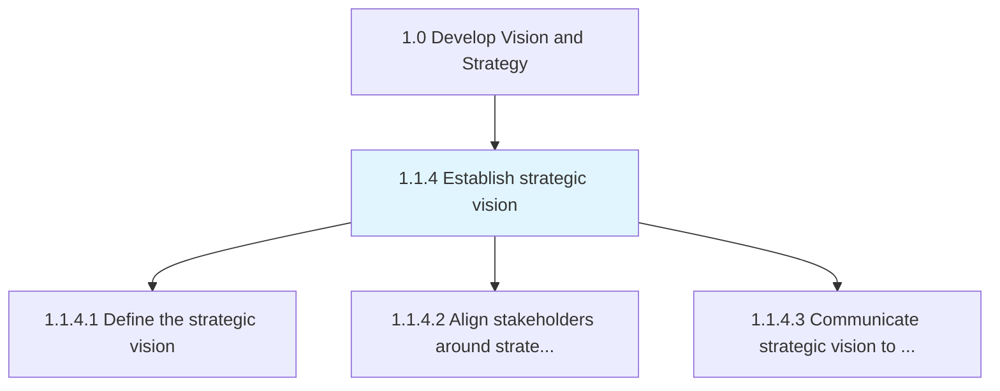
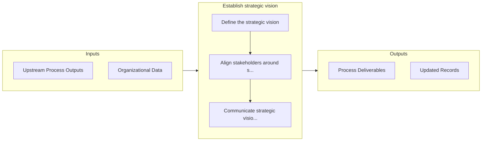

# Establish strategic vision

> Establishing the organization's long-term vision as a strategic positioning and engagement of stakeholders.

## Overview

Process 1.1.4 is a core process that defines the specific procedures for establish strategic vision. 

Establishing the organization's long-term vision as a strategic positioning and engagement of stakeholders. Institute the vision by creating strategic orientations of all stakeholders. Understand the strategy development frameworks in this context.

## Process Hierarchy



## Key Statistics

| Metric | Value |
|--------|-------|
| APQC Code | 10020 |
| Hierarchy ID | 1.1.4 |
| Level | Process |
| Parent | [1.1](../) |
| Sub-Processes | 3 |


## GraphDL Semantic Structure

```
establish.StrategicVision
```

| Component | Value | Description |
|-----------|-------|-------------|
| Verb | `establish` | Primary action |
| Object | `strategic vision` | Direct object |


## Process Flow



## Sub-Processes

| Process | Hierarchy ID | Description |
|---------|-------------|-------------|
| [Define the strategic vision](./DefineTheStrategicVision) | 1.1.4.1 | Developing goals to define organizations vision |
| [Align stakeholders around strategic vision](./AlignStakeholdersAroundStrategicVision) | 1.1.4.2 | Orienting those entities, associated with the organization that have a direct bearing on its operati |
| [Communicate strategic vision to stakeholders](./CommunicateStrategicVisionToStakeholders) | 1.1.4.3 | Developing and executing communication strategies to convey an alignment plan of all organizational  |


## Related Concepts

- StrategicVision


---

*Source: APQC PCF 10020 (1.1.4) - APQC*
