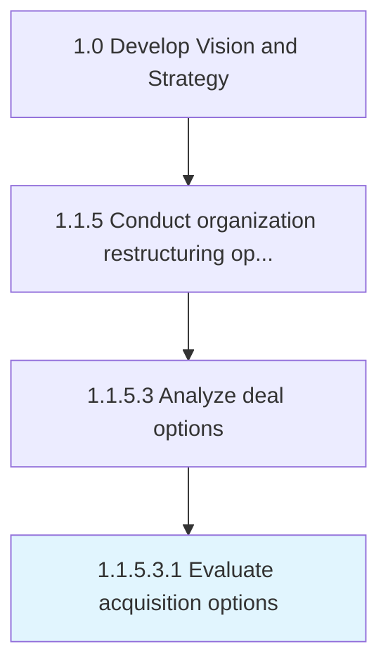

# Evaluate acquisition options

> Appraising entities identified as being suitable for acquisition, taking into account the restructuring opportunities in the internal and external context.

## Overview

Sub-Activity 1.1.5.3.1 is an activity within the Develop Vision and Strategy framework. 

Appraising entities identified as being suitable for acquisition, taking into account the restructuring opportunities in the internal and external context. Verify the appropriateness and viability of the short-listed options. Ensure these entities pertain to the state-of-affairs in the market, as well as fit with the resources and capabilities of the organization.

## Process Hierarchy



## Key Statistics

| Metric | Value |
|--------|-------|
| APQC Code | 16796 |
| Hierarchy ID | 1.1.5.3.1 |
| Level | Sub-Activity |
| Parent | [1.1.5.3](../) |
| Sub-Processes | 0 |


## GraphDL Semantic Structure

```
evaluate.AcquisitionOptions
```

| Component | Value | Description |
|-----------|-------|-------------|
| Verb | `evaluate` | Primary action |
| Object | `acquisition options` | Direct object |


## Related Concepts

- AcquisitionOptions


---

*Source: APQC PCF 16796 (1.1.5.3.1) - APQC*
