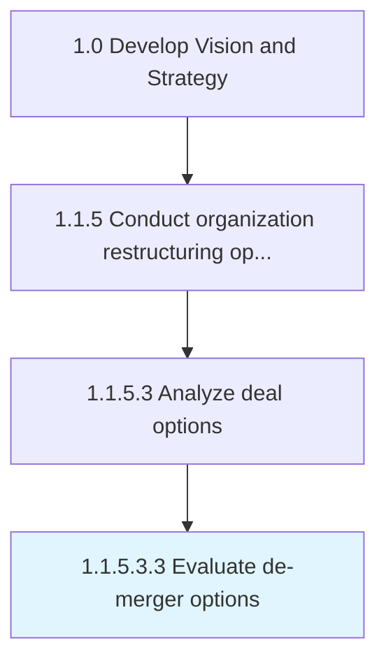

# Evaluate de-merger options

> Evaluating departments and subsidiaries within the organization, and/or previously merged entities, to assess the appropriateness of a de-merger, taking account of the fit between these entities as well as any relevant externalities.

## Overview

Sub-Activity 1.1.5.3.3 is an activity within the Develop Vision and Strategy framework. 

Evaluating departments and subsidiaries within the organization, and/or previously merged entities, to assess the appropriateness of a de-merger, taking account of the fit between these entities as well as any relevant externalities. Examine the pertinence and soundness of a formalized dissociation.

## Process Hierarchy



## Key Statistics

| Metric | Value |
|--------|-------|
| APQC Code | 16798 |
| Hierarchy ID | 1.1.5.3.3 |
| Level | Sub-Activity |
| Parent | [1.1.5.3](../) |
| Sub-Processes | 0 |


## GraphDL Semantic Structure

```
evaluate.DemergerOptions
```

| Component | Value | Description |
|-----------|-------|-------------|
| Verb | `evaluate` | Primary action |
| Object | `de-merger options` | Direct object |


---

*Source: APQC PCF 16798 (1.1.5.3.3) - APQC*
