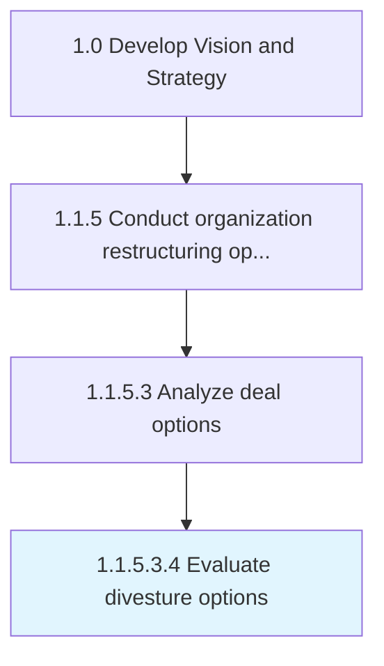

# Evaluate divesture options

> Evaluating departments and/or subsidiaries within the organization to assess the appropriateness of a divestment, taking account of all market externalities.

## Overview

Sub-Activity 1.1.5.3.4 is an activity within the Develop Vision and Strategy framework. 

Evaluating departments and/or subsidiaries within the organization to assess the appropriateness of a divestment, taking account of all market externalities. Examine any internal entities that have been identified to be suitable for dismemberment from the organization. Ensure the pertinence and soundness of such a move.

## Process Hierarchy



## Key Statistics

| Metric | Value |
|--------|-------|
| APQC Code | 16799 |
| Hierarchy ID | 1.1.5.3.4 |
| Level | Sub-Activity |
| Parent | [1.1.5.3](../) |
| Sub-Processes | 0 |


## GraphDL Semantic Structure

```
evaluate.DivestureOptions
```

| Component | Value | Description |
|-----------|-------|-------------|
| Verb | `evaluate` | Primary action |
| Object | `divesture options` | Direct object |


## Related Concepts

- DivestureOptions


---

*Source: APQC PCF 16799 (1.1.5.3.4) - APQC*
