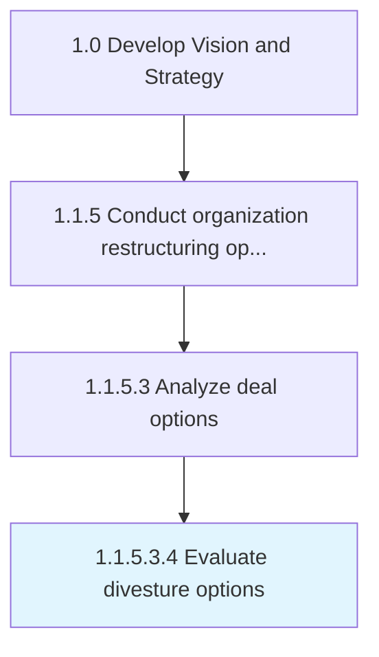
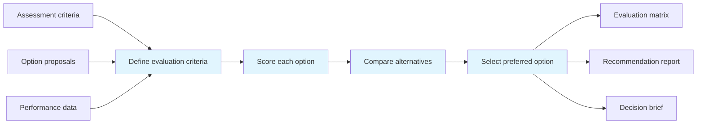

# Evaluate divesture options

> Evaluating departments and/or subsidiaries within the organization to assess the appropriateness of a divestment, taking account of all market externalities.

## Overview

Sub-Activity 1.1.5.3.4 is an activity within the Develop Vision and Strategy framework. 

Evaluating departments and/or subsidiaries within the organization to assess the appropriateness of a divestment, taking account of all market externalities. Examine any internal entities that have been identified to be suitable for dismemberment from the organization. Ensure the pertinence and soundness of such a move.

This process plays a critical role within the broader "Develop Vision and Strategy" capability area (APQC Category 1.0). By systematically executing this activity, organizations ensure that strategic decisions are grounded in thorough analysis and aligned with overall business objectives. The outputs of this process feed into downstream strategy development and execution activities, creating a foundation for informed decision-making across the enterprise.

## Process Hierarchy



## Key Statistics

| Metric | Value |
|--------|-------|
| APQC Code | 16799 |
| Hierarchy ID | 1.1.5.3.4 |
| Level | SubActivity |
| Parent | [1.1.5.3](../) |
| Sub-Processes | 0 |
| Estimated Duration | 1-4 weeks |
| Complexity | Medium |

## GraphDL Semantic Structure

```
evaluate.DivestureOptions
```

| Component | Value | Description |
|-----------|-------|-------------|
| Verb | `evaluate` | Primary action |
| Object | `divesture options` | Direct object |

## Process Flow



## RACI Matrix

| Activity | Responsible | Accountable | Consulted | Informed |
|----------|-------------|-------------|-----------|----------|
| Gather data and intelligence | Market Research Analyst | Strategy Director | Business Unit Leaders | Executive Team |
| Conduct analysis | Management Analyst | Strategy Director | Subject Matter Experts | Department Heads |
| Document findings | Business Analyst | Strategy Director | Market Research Team | Stakeholders |
| Present to leadership | Strategy Director | Chief Strategy Officer | Executive Sponsors | Board of Directors |

## Related Occupations

| Occupation | Role in Process |
|------------|----------------|
| [Chief Executives](/occupations/ChiefExecutives) | Primary strategic oversight and decision authority |
| [Market Research Analysts](/occupations/MarketResearchAnalysts) | Executes analysis and produces deliverables |
| [Management Analysts](/occupations/ManagementAnalysts) | Provides analytical frameworks and recommendations |
| [Business Intelligence Analysts](/occupations/BusinessIntelligenceAnalysts) | Supports data gathering and insight generation |
| [Strategic Planners](/occupations/StrategicPlanners) | Coordinates strategic alignment and planning |

## Related Departments

| Department | Involvement |
|------------|-------------|
| [Strategy & Planning](/departments/StrategyAndPlanning) | Primary owner and executor of this process |
| [Market Research](/departments/MarketResearch) | Provides supporting data, resources, and coordination |
| [Executive Leadership](/departments/ExecutiveLeadership) | Provides governance, approval, and strategic direction |

## Industry Variations

| Industry | Variation | Reference |
|----------|-----------|-----------|
| Manufacturing | Emphasizes supply chain and operational efficiency metrics in strategic planning | [manufacturing](/industries/manufacturing) |
| Financial Services | Focuses on regulatory compliance and risk management within strategy processes | [banking](/industries/banking) |
| Technology | Prioritizes innovation velocity and digital transformation in strategic initiatives | [consumer-electronics](/industries/consumer-electronics) |

## KPIs & Metrics

| KPI | Description | Target |
|-----|-------------|--------|
| Evaluation Thoroughness | Percentage of criteria assessed per option | 100% |
| Decision Quality | Post-decision success rate | > 75% |
| Time to Decision | Average time from evaluation start to recommendation | < 4 weeks |

## Related Concepts

- DivestureOptions

---

*Source: APQC PCF 16799 (1.1.5.3.4) - APQC*
