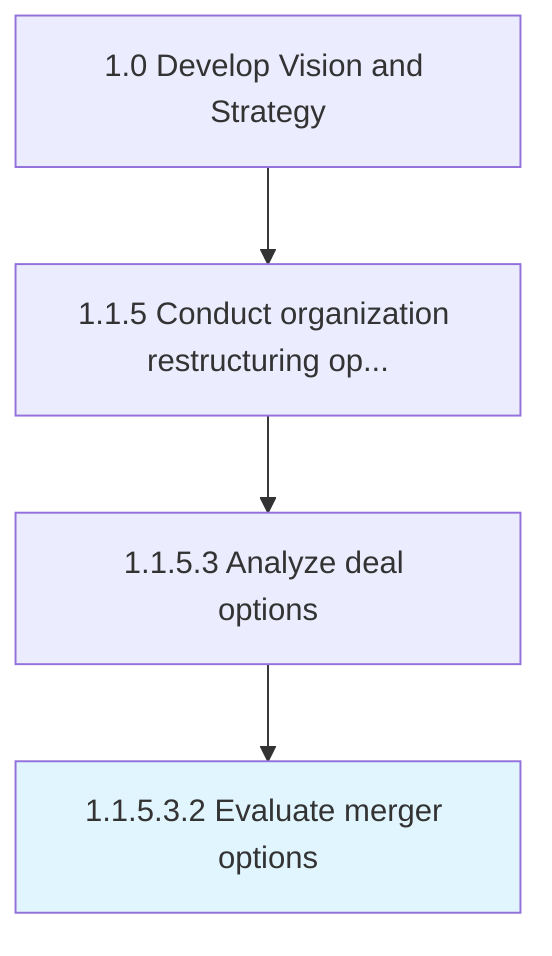

# Evaluate merger options

> Appraising entities identified as being suitable for a merger, taking stock of the restructuring opportunities within the firm and the market.

## Overview

Sub-Activity 1.1.5.3.2 is an activity within the Develop Vision and Strategy framework. 

Appraising entities identified as being suitable for a merger, taking stock of the restructuring opportunities within the firm and the market. Verify the appropriateness and viability of such options. Assess these entities to ensure their pertinence to the contextual state-of-affairs in the market, as well as a fit with the resources and capabilities of the organization itself. (This process can be carried out, in its entirety, by qualified in-house personnel or may be designated to specialist professional services providers.)

## Process Hierarchy



## Key Statistics

| Metric | Value |
|--------|-------|
| APQC Code | 16797 |
| Hierarchy ID | 1.1.5.3.2 |
| Level | Sub-Activity |
| Parent | [1.1.5.3](../) |
| Sub-Processes | 0 |


## GraphDL Semantic Structure

```
evaluate.MergerOptions
```

| Component | Value | Description |
|-----------|-------|-------------|
| Verb | `evaluate` | Primary action |
| Object | `merger options` | Direct object |


## Related Concepts

- [MergerOptions](/concepts/MergerOptions)


---

*Source: APQC PCF 16797 (1.1.5.3.2) - APQC*
