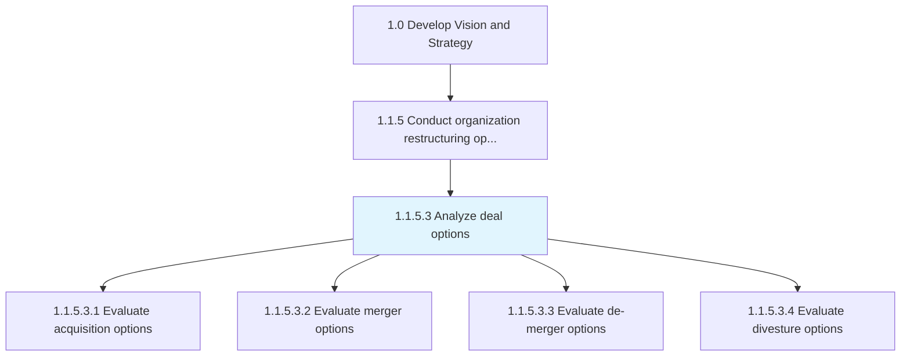
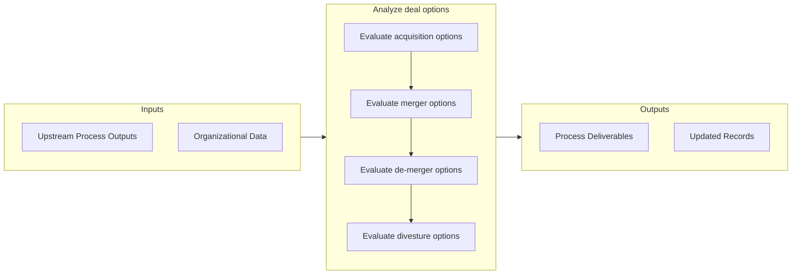

# Analyze deal options

> Examining various options shortlisted for assimilating new entities into the organization or dissociating from it.

## Overview

Activity 1.1.5.3 is an activity within the Develop Vision and Strategy framework. 

Examining various options shortlisted for assimilating new entities into the organization or dissociating from it. Undertake a piecemeal and comprehensive consideration of each option identified for acquisition, merger, de-merger, and divestment. Consider intangible and non-material aspects of the entities involved and synergic aspects. Consider the assistance of specialist professional services.

## Process Hierarchy



## Key Statistics

| Metric | Value |
|--------|-------|
| APQC Code | 16795 |
| Hierarchy ID | 1.1.5.3 |
| Level | Activity |
| Parent | [1.1.5](../) |
| Sub-Processes | 4 |


## GraphDL Semantic Structure

```
analyze.DealOptions
```

| Component | Value | Description |
|-----------|-------|-------------|
| Verb | `analyze` | Primary action |
| Object | `deal options` | Direct object |


## Process Flow



## Sub-Processes

| Process | Hierarchy ID | Description |
|---------|-------------|-------------|
| [Evaluate acquisition options](./EvaluateAcquisitionOptions) | 1.1.5.3.1 | Appraising entities identified as being suitable for acquisition, taking into account the restructur |
| [Evaluate merger options](./EvaluateMergerOptions) | 1.1.5.3.2 | Appraising entities identified as being suitable for a merger, taking stock of the restructuring opp |
| [Evaluate de-merger options](./EvaluateDemergerOptions) | 1.1.5.3.3 | Evaluating departments and subsidiaries within the organization, and/or previously merged entities,  |
| [Evaluate divesture options](./EvaluateDivestureOptions) | 1.1.5.3.4 | Evaluating departments and/or subsidiaries within the organization to assess the appropriateness of  |


## Related Concepts

- [DealOptions](/concepts/DealOptions)


---

*Source: APQC PCF 16795 (1.1.5.3) - APQC*
