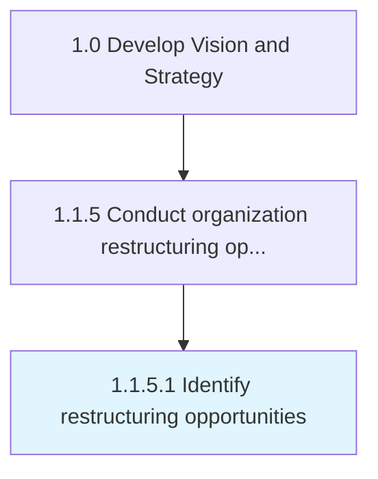

# Identify restructuring opportunities

> Identifying opportunities for restructuring the organization, through an analysis of internal viability and external contingency.

## Overview

Activity 1.1.5.1 is an activity within the Develop Vision and Strategy framework. 

Identifying opportunities for restructuring the organization, through an analysis of internal viability and external contingency. Conduct a broad-based survey of the market landscape, taking the large-scale trends and movements into account, to determine the necessity and possibility of restructuring the organization. Review the organization's internal capacities, the readiness of its process frameworks, the robustness of its financials, the capableness of its systems, the resourcefulness of its personnel, etc. for assimilating an extensive overhaul.

## Process Hierarchy



## Key Statistics

| Metric | Value |
|--------|-------|
| APQC Code | 16793 |
| Hierarchy ID | 1.1.5.1 |
| Level | Activity |
| Parent | [1.1.5](../) |
| Sub-Processes | 0 |


## GraphDL Semantic Structure

```
identify.RestructuringOpportunities
```

| Component | Value | Description |
|-----------|-------|-------------|
| Verb | `identify` | Primary action |
| Object | `restructuring opportunities` | Direct object |


## Related Concepts

- RestructuringOpportunities


---

*Source: APQC PCF 16793 (1.1.5.1) - APQC*
