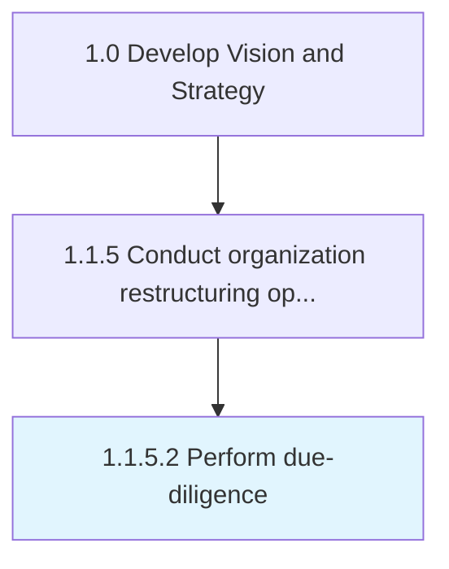

# Perform due-diligence

> Auditing the status quo of the probabilities, before formalizing any restructuring of the organization with another entity.

## Overview

Activity 1.1.5.2 is an activity within the Develop Vision and Strategy framework. 

Auditing the status quo of the probabilities, before formalizing any restructuring of the organization with another entity. Systematically investigate all entities discerned to be of interest in Identify restructuring opportunities [16793], to verify all tangible and substantial facts. Consider engaging specialist professional services including legal, accounting, and consulting help.

## Process Hierarchy



## Key Statistics

| Metric | Value |
|--------|-------|
| APQC Code | 16794 |
| Hierarchy ID | 1.1.5.2 |
| Level | Activity |
| Parent | [1.1.5](../) |
| Sub-Processes | 0 |


## GraphDL Semantic Structure

```
perform.Duediligence
```

| Component | Value | Description |
|-----------|-------|-------------|
| Verb | `perform` | Primary action |
| Object | `due-diligence` | Direct object |


---

*Source: APQC PCF 16794 (1.1.5.2) - APQC*
