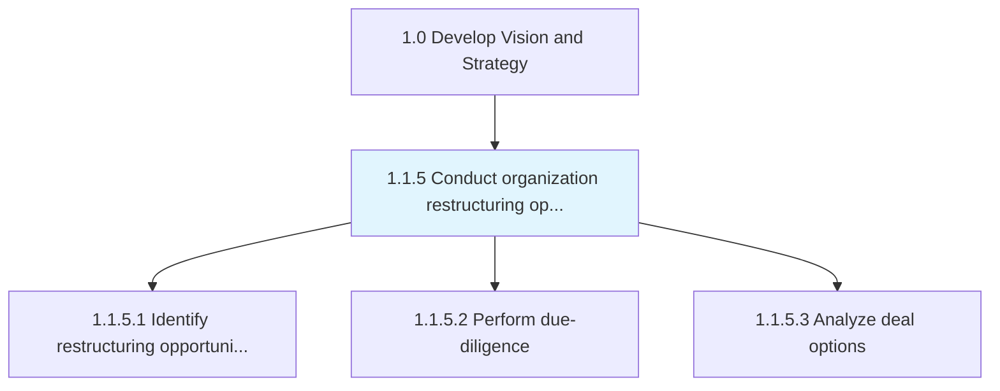
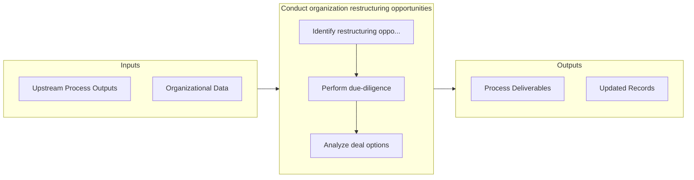

# Conduct organization restructuring opportunities

> Examining the scope and contingencies for restructuring based on market situation and internal realities.

## Overview

Process 1.1.5 is a core process that defines the specific procedures for conduct organization restructuring opportunities. 

Examining the scope and contingencies for restructuring based on market situation and internal realities. Map the market forces over which any and all probabilities can be probed for utility and viability. Once the restructuring options have been analyzed and the due-diligence performed, execute the deal. Consider seeking professional services for assistance in formalizing these opportunities.

## Process Hierarchy



## Key Statistics

| Metric | Value |
|--------|-------|
| APQC Code | 16792 |
| Hierarchy ID | 1.1.5 |
| Level | Process |
| Parent | [1.1](../) |
| Sub-Processes | 3 |


## Process Overview

Strategy processes define the organization's vision, direction, and strategic initiatives to achieve business objectives. This process focuses on conduct organization restructuring opportunities, which is essential for organizational effectiveness and achieving business objectives.

## Key Metrics

| Metric | Description | Target |
|--------|-------------|--------|
| Strategic initiative completion rate | Measure of strategic initiative completion rate | Target varies by organization |
| Revenue growth | Measure of revenue growth | Target varies by organization |
| Market share | Measure of market share | Target varies by organization |
| Customer satisfaction | Measure of customer satisfaction | Target varies by organization |

## Related Departments

- [Executive](/departments/Executive)
- [Strategy](/departments/Strategy)
- [Finance](/departments/Finance)

## Related Occupations

- [Chief Executives](/occupations/Management/ChiefExecutives)
- [Management Analysts](/occupations/Business/ManagementAnalysts)
- [General and Operations Managers](/occupations/Management/GeneralAndOperationsManagers)

## RACI Matrix

| Activity | Responsible | Accountable | Consulted | Informed |
|----------|-------------|-------------|-----------|----------|
| Plan | Process Owner | Manager | Stakeholders | Team |
| Execute | Team | Process Owner | Manager | Stakeholders |
| Monitor | Analyst | Manager | Process Owner | Leadership |
| Improve | Process Owner | Manager | Team | Stakeholders |

## GraphDL Semantic Structure

```graphdl
conduct.OrganizationRestructuringOpportunities
```

| Component | Value | Description |
|-----------|-------|-------------|
| Verb | `conduct` | Primary action |
| Object | `organization restructuring opportunities` | Direct object |


## Process Flow



## Sub-Processes

| Process | Hierarchy ID | Description |
|---------|-------------|-------------|
| [Identify restructuring opportunities](./IdentifyRestructuringOpportunities) | 1.1.5.1 | Identifying opportunities for restructuring the organization, through an analysis of internal viabil |
| [Perform due-diligence](./PerformDuediligence) | 1.1.5.2 | Auditing the status quo of the probabilities, before formalizing any restructuring of the organizati |
| [Analyze deal options](./1.1.5.3-AnalyzeDealOptions/) | 1.1.5.3 | Examining various options shortlisted for assimilating new entities into the organization or dissoci |


## Related Concepts

- OrganizationRestructuringOpportunities


---

*Source: APQC PCF 16792 (1.1.5) - APQC*
