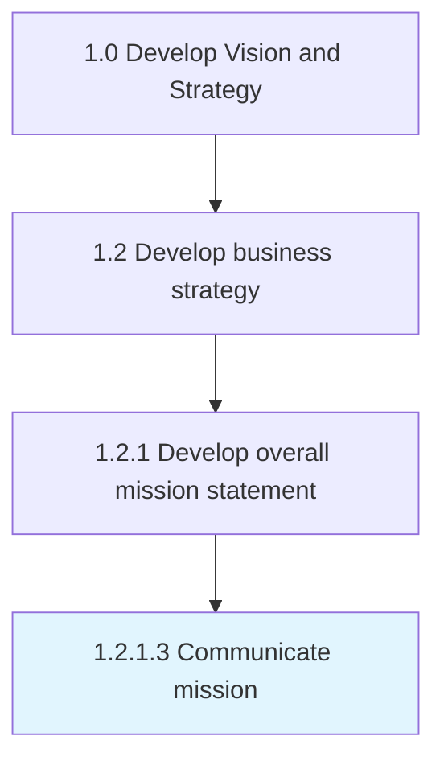

# Communicate mission

> Developing and executing a communication strategy to convey the mission statement.

## Overview

Activity 1.2.1.3 is an activity within the Develop Vision and Strategy framework. 

Developing and executing a communication strategy to convey the mission statement. Create a universal communication strategy and appropriate delivery channels, with the objective of leveraging the latter to execute the former. Convey the inherent message of the mission to all stakeholders, including employees, customers, and the public. Ensure collaboration between senior strategy personnel and the communications/marketing team.

## Process Hierarchy



## Key Statistics

| Metric | Value |
|--------|-------|
| APQC Code | 10046 |
| Hierarchy ID | 1.2.1.3 |
| Level | Activity |
| Parent | [1.2.1](../) |
| Sub-Processes | 0 |


## GraphDL Semantic Structure

```
communicate.Mission
```

| Component | Value | Description |
|-----------|-------|-------------|
| Verb | `communicate` | Primary action |
| Object | `mission` | Direct object |


## Related Concepts

- [Mission](/concepts/Mission)


---

*Source: APQC PCF 10046 (1.2.1.3) - APQC*
