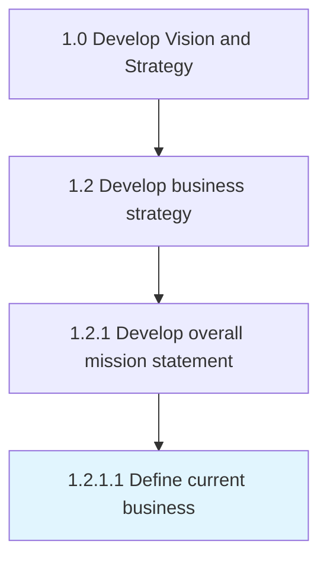

# Define current business

> Defining the status quo relating to the de facto core of what the business is.

## Overview

Activity 1.2.1.1 is an activity within the Develop Vision and Strategy framework. 

Defining the status quo relating to the de facto core of what the business is. Reflect over the fundamental essence of what the business accomplishes and the manner in which it operates. Look beyond the obvious solution capabilities to delineate capacities that form the basis of the business engine. Involve senior executives and management personnel and possibly professional services providers.

## Process Hierarchy



## Key Statistics

| Metric | Value |
|--------|-------|
| APQC Code | 10044 |
| Hierarchy ID | 1.2.1.1 |
| Level | Activity |
| Parent | [1.2.1](../) |
| Sub-Processes | 0 |


## GraphDL Semantic Structure

```
define.CurrentBusiness
```

| Component | Value | Description |
|-----------|-------|-------------|
| Verb | `define` | Primary action |
| Object | `current business` | Direct object |


## Related Concepts

- [CurrentBusiness](/concepts/CurrentBusiness)


---

*Source: APQC PCF 10044 (1.2.1.1) - APQC*
