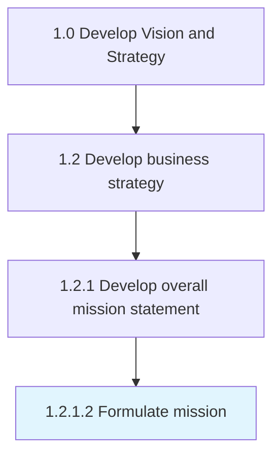

# Formulate mission

> Outlining actionable objectives that effectively set a course to fulfill the organization's vision.

## Overview

Activity 1.2.1.2 is an activity within the Develop Vision and Strategy framework. 

Outlining actionable objectives that effectively set a course to fulfill the organization's vision. In this fundamental activity, articulate certain goals or targets in broad but practicable terms to reach long-term objectives.

## Process Hierarchy



## Key Statistics

| Metric | Value |
|--------|-------|
| APQC Code | 10045 |
| Hierarchy ID | 1.2.1.2 |
| Level | Activity |
| Parent | [1.2.1](../) |
| Sub-Processes | 0 |


## GraphDL Semantic Structure

```
formulate.Mission
```

| Component | Value | Description |
|-----------|-------|-------------|
| Verb | `formulate` | Primary action |
| Object | `mission` | Direct object |


## Related Concepts

- [Mission](/concepts/Mission)


---

*Source: APQC PCF 10045 (1.2.1.2) - APQC*
