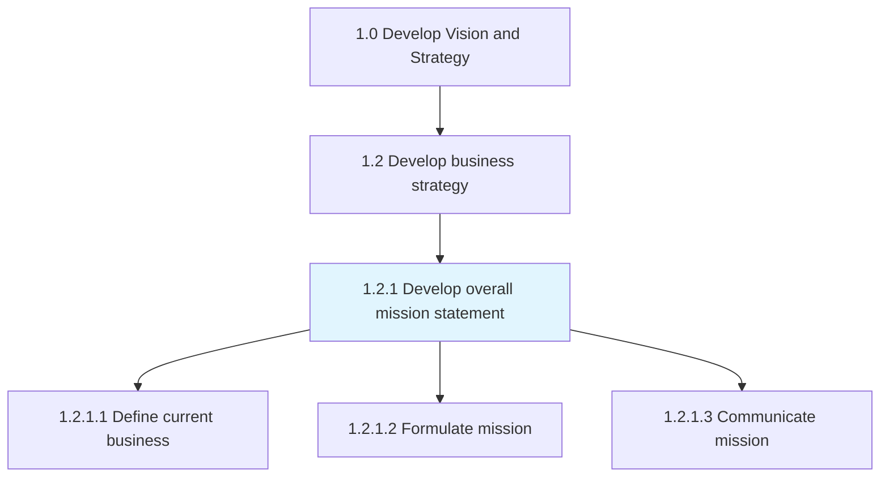
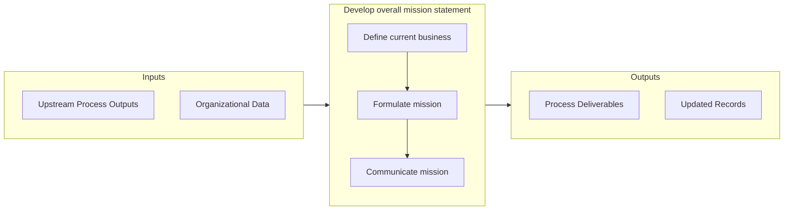

# Develop overall mission statement

> Establishing an overarching, compact statement that concisely underscores the mission of the organization.

## Overview

Process 1.2.1 is a core process that defines the specific procedures for develop overall mission statement. 

Establishing an overarching, compact statement that concisely underscores the mission of the organization. Define and communicate a clear and succinct mission statement, which encapsulates how the organization aims to proceed in order to Establish a strategic vision [10020]. Solicit critical inputs from senior management and strategy executives, and collaborate with marketing or personnel from allied functions.

## Process Hierarchy



## Key Statistics

| Metric | Value |
|--------|-------|
| APQC Code | 10037 |
| Hierarchy ID | 1.2.1 |
| Level | Process |
| Parent | [1.2](../) |
| Sub-Processes | 3 |


## GraphDL Semantic Structure

```
develop.OverallMissionStatement
```

| Component | Value | Description |
|-----------|-------|-------------|
| Verb | `develop` | Primary action |
| Object | `overall mission statement` | Direct object |


## Process Flow



## Sub-Processes

| Process | Hierarchy ID | Description |
|---------|-------------|-------------|
| [Define current business](./DefineCurrentBusiness) | 1.2.1.1 | Defining the status quo relating to the de facto core of what the business is |
| [Formulate mission](./FormulateMission) | 1.2.1.2 | Outlining actionable objectives that effectively set a course to fulfill the organization's vision |
| [Communicate mission](./CommunicateMission) | 1.2.1.3 | Developing and executing a communication strategy to convey the mission statement |


## Related Concepts

- OverallMissionStatement


---

*Source: APQC PCF 10037 (1.2.1) - APQC*
