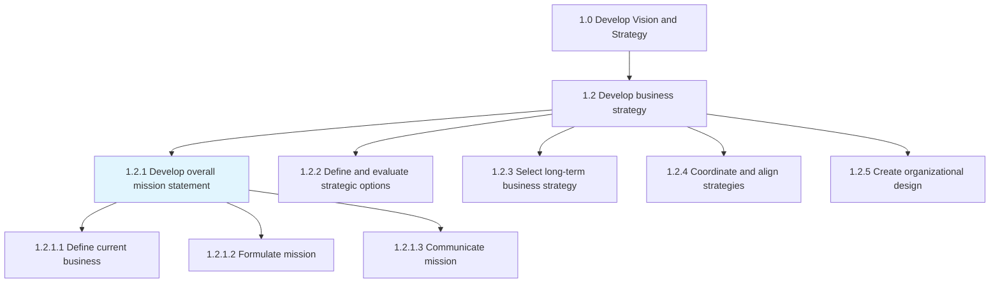
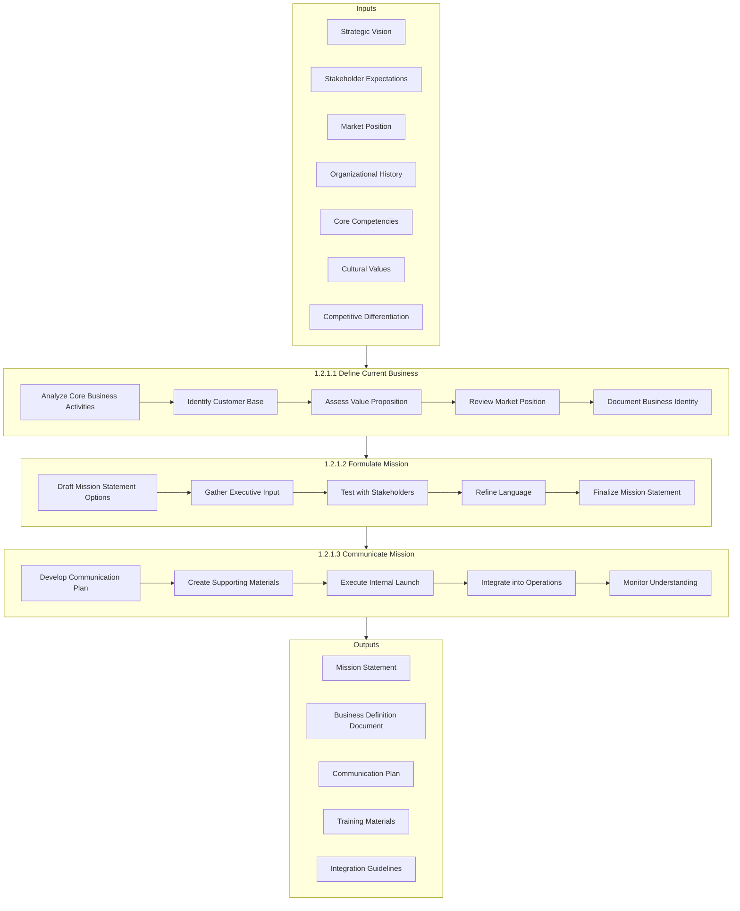
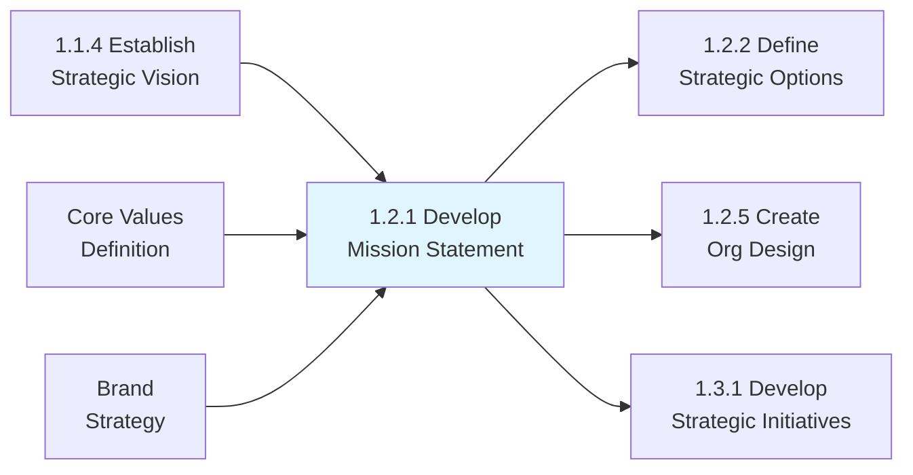

# Develop overall mission statement

> Establishing an overarching, compact statement that concisely underscores the mission of the organization.

## Overview

Process 1.2.1 - Develop Overall Mission Statement is a foundational process that articulates the organization's fundamental purpose, reason for existence, and core values. The mission statement serves as the organization's identity declaration, answering the questions: "Why do we exist?" and "What do we do?"

Unlike the vision statement (which describes a desired future state), the mission statement is grounded in the present and describes the organization's current purpose and activities. It provides the foundation for strategic decision-making, guides resource allocation, and serves as a compass for organizational behavior and culture.

A well-crafted mission statement aligns employees around a common purpose, differentiates the organization from competitors, communicates value to customers and stakeholders, and provides criteria for evaluating strategic opportunities. This process involves defining the current business, formulating the mission with input from leadership, and communicating it effectively throughout the organization.

## Process Hierarchy



## Key Statistics

| Metric | Value |
|--------|-------|
| APQC Code | 10037 |
| Hierarchy ID | 1.2.1 |
| Level | Process |
| Parent | [1.2 Develop Business Strategy](../) |
| Child Activities | 3 |
| Typical Duration | 3-6 weeks |
| Review Frequency | Every 5-10 years |

## GraphDL Semantic Structure

```graphdl
develop.OverallMissionStatement
```

| Component | Value | Description |
|-----------|-------|-------------|
| Verb | `develop` | Creating and establishing |
| Object | `OverallMissionStatement` | Organizational purpose declaration |
| Preposition | - | Not applicable |
| PrepObject | - | Not applicable |

## Process Flow



## Sub-Processes

### [1.2.1.1 Define current business](./DefineCurrentBusiness/)

Defining the status quo relating to the de facto core of what the business is. This activity establishes a clear understanding of the organization's current identity, markets, customers, and value proposition.

**Key Activities:**
- Analyze core products, services, and capabilities
- Identify primary customer segments and their needs
- Assess the value proposition and competitive advantages
- Review market positioning and competitive landscape
- Document the essence of the current business

**APQC Code:** 10040 | **Typical Duration:** 1-2 weeks

### [1.2.1.2 Formulate mission](./FormulateMission/)

Outlining actionable objectives that effectively set a course to fulfill the organization's vision. This involves crafting a clear, memorable mission statement that captures organizational purpose.

**Key Activities:**
- Draft multiple mission statement options
- Gather input from executives and key stakeholders
- Test statements with diverse audiences
- Refine language for clarity and impact
- Secure executive and board approval

**APQC Code:** 10041 | **Typical Duration:** 2-3 weeks

### [1.2.1.3 Communicate mission](./CommunicateMission/)

Developing and executing a communication strategy to convey the mission statement. This ensures the mission is understood, internalized, and applied throughout the organization.

**Key Activities:**
- Develop comprehensive communication plan
- Create materials for different audiences
- Execute coordinated internal launch
- Integrate mission into daily operations
- Monitor and reinforce understanding

**APQC Code:** 10042 | **Typical Duration:** 2-4 weeks (initial), ongoing

## Mission Statement Components

| Component | Description | Example Question |
|-----------|-------------|------------------|
| Purpose | Why the organization exists | Why are we here? |
| Business | What the organization does | What do we do? |
| Values | How the organization operates | How do we behave? |
| Customers | Whom the organization serves | Who do we serve? |
| Differentiation | What makes the organization unique | What makes us different? |

## RACI Matrix

| Activity | Responsible | Accountable | Consulted | Informed |
|----------|-------------|-------------|-----------|----------|
| Define current business | Strategy Team | CSO | All Executives | Board |
| Analyze core competencies | Operations/Strategy | COO | All Functions | Leadership |
| Draft mission options | Strategy/Executive Team | CEO | Board, CMO | Employees |
| Gather stakeholder input | HR/Strategy | CHRO | All Stakeholders | - |
| Finalize mission statement | CEO | Board | All Executives | All |
| Develop communication plan | Corporate Communications | CMO | HR, Strategy | All |
| Execute internal launch | Communications/HR | CHRO | All Managers | All Employees |
| Integrate into operations | All Functions | COO | HR | Leadership |

## Metrics & KPIs

| Metric | Description | Target | Frequency |
|--------|-------------|--------|-----------|
| Mission Awareness | Employees who can recall mission | >95% | Annual |
| Mission Understanding | Employees who understand mission meaning | >85% | Annual |
| Mission Relevance | Employees who see mission in their work | >80% | Annual |
| Stakeholder Alignment | External stakeholder awareness | >70% | Bi-annual |
| Decision Alignment | Decisions referencing mission | Increasing | Quarterly |
| Culture Alignment | Behaviors consistent with mission | >85% | Annual |
| Communication Reach | Employees receiving mission communication | 100% | Per launch |

## Related Departments

| Department | Role in Mission Development |
|------------|----------------------------|
| Executive Office | Mission ownership and final approval |
| Strategy | Process facilitation and analysis |
| Corporate Communications | Communication strategy and execution |
| Human Resources | Culture alignment and training |
| Marketing | External messaging alignment |
| All Departments | Input, adoption, and integration |

## Related Occupations

- [Chief Executive Officers](/occupations/Management/ChiefExecutives) - Mission accountability and approval
- [Chief Strategy Officers](/occupations/Management/StrategyOfficers) - Mission development facilitation
- [Chief Marketing Officers](/occupations/Management/MarketingManagers) - Brand and message alignment
- [Chief Human Resources Officers](/occupations/Management/HRManagers) - Culture and engagement
- [Corporate Communications Directors](/occupations/Management/PRManagers) - Communication execution
- [Strategic Planners](/occupations/Business/StrategicPlanners) - Analysis and drafting

## Industry Variations

### Healthcare
Mission statements emphasize patient care, healing, and community health. Stakeholder group includes medical staff, patients, and community. Regulatory and ethical considerations prominent.

**Example Elements:** Patient-centered care, clinical excellence, community health, compassionate service

### Financial Services
Mission focuses on trust, financial security, and customer prosperity. Regulatory compliance and fiduciary responsibility embedded. Digital transformation increasingly referenced.

**Example Elements:** Financial well-being, trust, security, prosperity, responsible growth

### Technology
Mission often emphasizes innovation, empowerment, and transformation. Shorter and more dynamic statements. Purpose-driven messaging around societal impact.

**Example Elements:** Innovation, empowerment, connection, transformation, accessibility

### Non-Profit
Mission is central to identity and funding. Impact and beneficiary focus paramount. Donor and volunteer engagement considerations.

**Example Elements:** Social impact, community service, advocacy, education, empowerment

### Manufacturing
Mission emphasizes quality, reliability, and value creation. Sustainability increasingly prominent. Customer and employee focus balanced.

**Example Elements:** Quality, reliability, innovation, sustainability, value

## Best Practices

### Mission Statement Characteristics
- **Clear**: Easily understood by all audiences
- **Concise**: Typically 1-3 sentences, memorable
- **Purpose-driven**: Answers "why we exist"
- **Unique**: Differentiates from competitors
- **Inspiring**: Motivates employees and stakeholders
- **Timeless**: Endures beyond current strategy
- **Actionable**: Guides decision-making

### Development Process
- Start with strategic vision as foundation
- Involve diverse stakeholders in development
- Test multiple versions with different audiences
- Avoid jargon and generic language
- Balance aspiration with authenticity
- Ensure board and executive alignment

### Communication Excellence
- Multi-channel, sustained communication
- Leadership role-modeling
- Integration into onboarding and training
- Visual reinforcement (signage, materials)
- Regular reference in communications
- Success story connections

## Mission vs. Vision vs. Values

| Element | Focus | Time Horizon | Example |
|---------|-------|--------------|---------|
| Mission | Purpose - why we exist | Present/Timeless | "To organize the world's information" |
| Vision | Aspiration - where we're going | Future (5-10 years) | "A world where everyone has access to information" |
| Values | Behavior - how we operate | Constant | "Integrity, Innovation, Customer Focus" |

## Related Processes



## Integration Touchpoints

| Touchpoint | Integration Approach |
|------------|---------------------|
| Hiring | Reference in job postings, interviews |
| Onboarding | Mission training for new employees |
| Performance | Alignment in goal-setting and reviews |
| Recognition | Awards tied to mission demonstration |
| Communications | Regular reinforcement in messaging |
| Decisions | Reference in strategic choices |
| Brand | Alignment with external messaging |

## Related Concepts

- Mission Statement
- Organizational Purpose
- Core Values
- Strategic Vision
- Corporate Identity
- Stakeholder Communication
- Cultural Alignment

---

*Source: APQC PCF 10037 (1.2.1) - Cross-Industry*
