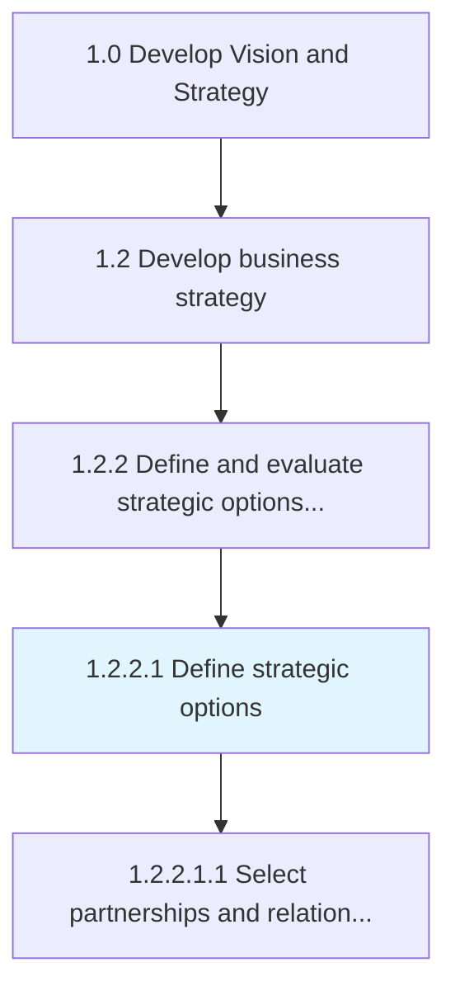
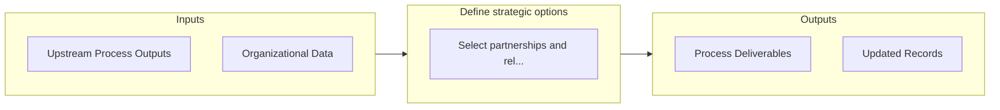

# Define strategic options

> Defining the various options available to achieve the goals highlighted in the mission statement.

## Overview

Activity 1.2.2.1 is an activity within the Develop Vision and Strategy framework. 

Defining the various options available to achieve the goals highlighted in the mission statement. Delineate (in accordance with a predefined criteria) the various permutations of strategic decisions that would help the organization achieve the objectives outlined in Develop overall mission statement [10037]. Involve senior management and key strategy personnel, with timely help from professional services providers.

## Process Hierarchy



## Key Statistics

| Metric | Value |
|--------|-------|
| APQC Code | 10047 |
| Hierarchy ID | 1.2.2.1 |
| Level | Activity |
| Parent | [1.2.2](../) |
| Sub-Processes | 1 |


## GraphDL Semantic Structure

```
define.StrategicOptions
```

| Component | Value | Description |
|-----------|-------|-------------|
| Verb | `define` | Primary action |
| Object | `strategic options` | Direct object |


## Process Flow



## Sub-Processes

| Process | Hierarchy ID | Description |
|---------|-------------|-------------|
| [Select partnerships and relationships to support the extended enterprise](./SelectPartnershipsAndRelationshipsToSupportTheExtendedEnterprise) | 1.2.2.1.1 | Supporting the design, manufacture and distribution of product and services through the extended ent |


## Related Concepts

- StrategicOptions


---

*Source: APQC PCF 10047 (1.2.2.1) - APQC*
