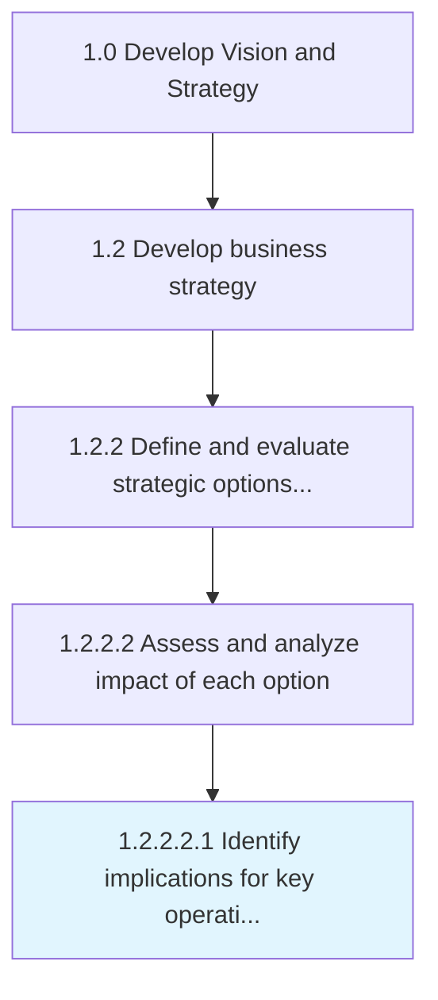

# Identify implications for key operating model business elements that require change

> Determine impacts of elements such as staffing, skills, training, new markets, technology, or policies within operating model which needs change.

## Overview

Sub-Activity 1.2.2.2.1 is an activity within the Develop Vision and Strategy framework. 

Determine impacts of elements such as staffing, skills, training, new markets, technology, or policies within operating model which needs change.

## Process Hierarchy



## Key Statistics

| Metric | Value |
|--------|-------|
| APQC Code | 13289 |
| Hierarchy ID | 1.2.2.2.1 |
| Level | Sub-Activity |
| Parent | [1.2.2.2](../) |
| Sub-Processes | 0 |


## GraphDL Semantic Structure

```
identify.Implications.for.KeyOperatingModelBusinessElementsThatRequireChange
```

| Component | Value | Description |
|-----------|-------|-------------|
| Verb | `identify` | Primary action |
| Object | `implications` | Direct object |
| Preposition | `for` | Relationship |
| PrepObject | `key operating model business elements that require change` | Indirect object |


## Related Concepts

- [Implications](/concepts/Implications)
- [KeyOperatingModelBusinessElementsRequireChange](/concepts/KeyOperatingModelBusinessElementsRequireChange)


---

*Source: APQC PCF 13289 (1.2.2.2.1) - APQC*
