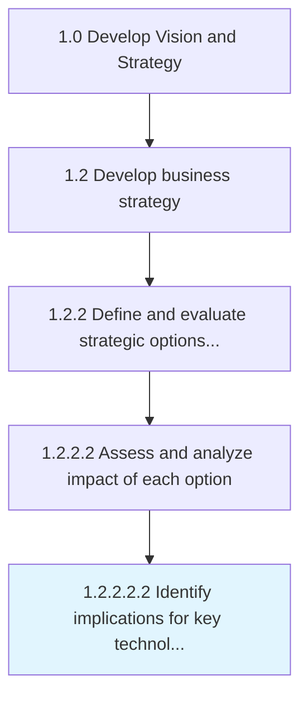

# Identify implications for key technology aspects

> Determining key factors for technology ROI, benefits, architecture, etc.

## Overview

Sub-Activity 1.2.2.2.2 is an activity within the Develop Vision and Strategy framework. 

Determining key factors for technology ROI, benefits, architecture, etc.

## Process Hierarchy



## Key Statistics

| Metric | Value |
|--------|-------|
| APQC Code | 13290 |
| Hierarchy ID | 1.2.2.2.2 |
| Level | Sub-Activity |
| Parent | [1.2.2.2](../) |
| Sub-Processes | 0 |


## GraphDL Semantic Structure

```
identify.Implications.for.KeyTechnologyAspects
```

| Component | Value | Description |
|-----------|-------|-------------|
| Verb | `identify` | Primary action |
| Object | `implications` | Direct object |
| Preposition | `for` | Relationship |
| PrepObject | `key technology aspects` | Indirect object |


## Related Concepts

- [Implications](/concepts/Implications)
- [KeyTechnologyAspects](/concepts/KeyTechnologyAspects)


---

*Source: APQC PCF 13290 (1.2.2.2.2) - APQC*
