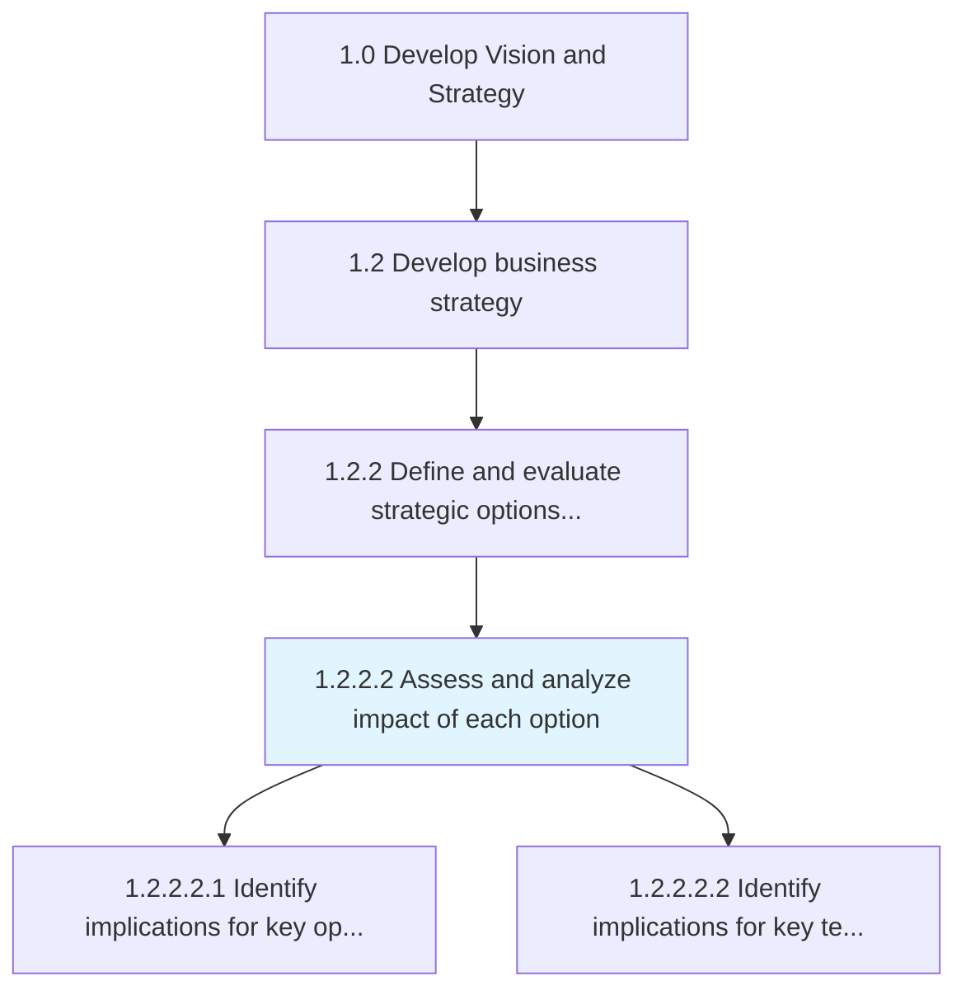
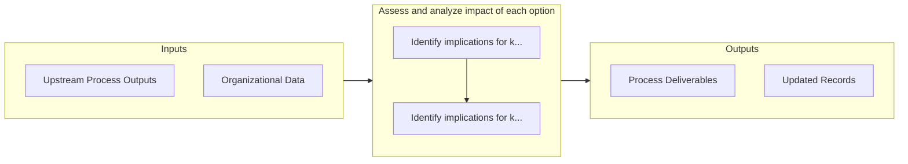

# Assess and analyze impact of each option

> Scoping and probing to study the impact of strategic options for fulfilling the organization's objectives.

## Overview

Activity 1.2.2.2 is an activity within the Develop Vision and Strategy framework. 

Scoping and probing to study the impact of strategic options for fulfilling the organization's objectives. Estimate a measure of the impact effectuated by each set of strategic decisions, which comprise Define strategic options [10047]. Closely examine the consequences of each option.

## Process Hierarchy



## Key Statistics

| Metric | Value |
|--------|-------|
| APQC Code | 10048 |
| Hierarchy ID | 1.2.2.2 |
| Level | Activity |
| Parent | [1.2.2](../) |
| Sub-Processes | 2 |


## GraphDL Semantic Structure

```
assess.AndAnalyzeImpact.of.EachOption
```

| Component | Value | Description |
|-----------|-------|-------------|
| Verb | `assess` | Primary action |
| Object | `and analyze impact` | Direct object |
| Preposition | `of` | Relationship |
| PrepObject | `each option` | Indirect object |


## Process Flow



## Sub-Processes

| Process | Hierarchy ID | Description |
|---------|-------------|-------------|
| [Identify implications for key operating model business elements that require change](./IdentifyImplicationsForKeyOperatingModelBusinessElementsThatRequireChange) | 1.2.2.2.1 | Determine impacts of elements such as staffing, skills, training, new markets, technology, or polici |
| [Identify implications for key technology aspects](./IdentifyImplicationsForKeyTechnologyAspects) | 1.2.2.2.2 | Determining key factors for technology ROI, benefits, architecture, etc |


## Related Concepts

- [Impact](/concepts/Impact)
- [Option](/concepts/Option)
- [Impact](/concepts/Impact)
- [Option](/concepts/Option)


---

*Source: APQC PCF 10048 (1.2.2.2) - APQC*
