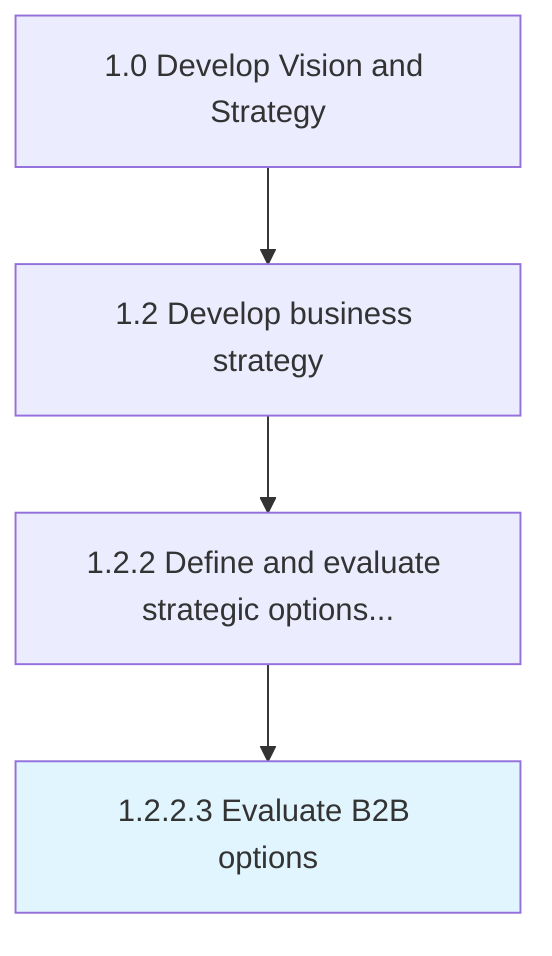

# Evaluate B2B options

> Evaluating future business to business opportunities against past and current approaches and performance.

## Overview

Activity 1.2.2.3 is an activity within the Develop Vision and Strategy framework. 

Evaluating future business to business opportunities against past and current approaches and performance. Gather insights into what competitors and other similar organizations are doing and the needs, goals, and expectations of stakeholders and partners to understand potential future impact.

## Process Hierarchy



## Key Statistics

| Metric | Value |
|--------|-------|
| APQC Code | 21606 |
| Hierarchy ID | 1.2.2.3 |
| Level | Activity |
| Parent | [1.2.2](../) |
| Sub-Processes | 0 |


## GraphDL Semantic Structure

```
evaluate.B2BOptions
```

| Component | Value | Description |
|-----------|-------|-------------|
| Verb | `evaluate` | Primary action |
| Object | `B2B options` | Direct object |


## Related Concepts

- [BBOptions](/concepts/BBOptions)


---

*Source: APQC PCF 21606 (1.2.2.3) - APQC*
