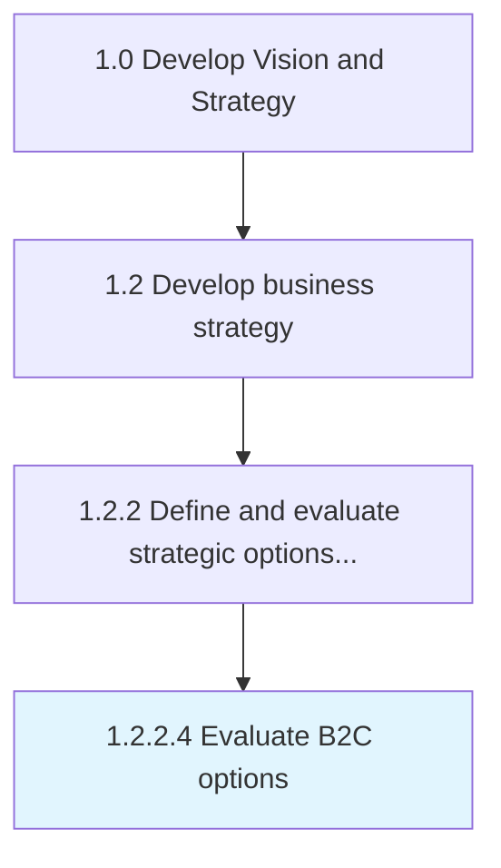

# Evaluate B2C options

> Evaluating future business to customer opportunities against past and current approaches and performance.

## Overview

Activity 1.2.2.4 is an activity within the Develop Vision and Strategy framework. 

Evaluating future business to customer opportunities against past and current approaches and performance. Gather insights into what competitors and other similar organizations are doing and the needs, goals, and expectations of customers and partners to understand potential future impact.

## Process Hierarchy



## Key Statistics

| Metric | Value |
|--------|-------|
| APQC Code | 21607 |
| Hierarchy ID | 1.2.2.4 |
| Level | Activity |
| Parent | [1.2.2](../) |
| Sub-Processes | 0 |


## GraphDL Semantic Structure

```
evaluate.B2COptions
```

| Component | Value | Description |
|-----------|-------|-------------|
| Verb | `evaluate` | Primary action |
| Object | `B2C options` | Direct object |


## Related Concepts

- BCOptions


---

*Source: APQC PCF 21607 (1.2.2.4) - APQC*
