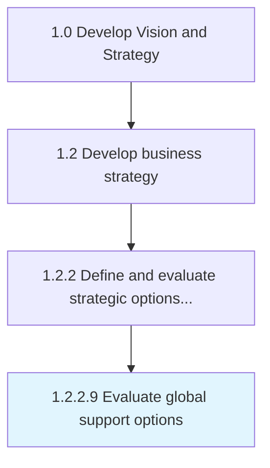

# Evaluate global support options

> Evaluating options for global support services and functions.

## Overview

Activity 1.2.2.9 is an activity within the Develop Vision and Strategy framework. 

Evaluating options for global support services and functions. This should include structure, scale, adaptability to change, and alternative delivery models to balance cost, performance, and customer value.

## Process Hierarchy



## Key Statistics

| Metric | Value |
|--------|-------|
| APQC Code | 21612 |
| Hierarchy ID | 1.2.2.9 |
| Level | Activity |
| Parent | [1.2.2](../) |
| Sub-Processes | 0 |


## GraphDL Semantic Structure

```
evaluate.GlobalSupportOptions
```

| Component | Value | Description |
|-----------|-------|-------------|
| Verb | `evaluate` | Primary action |
| Object | `global support options` | Direct object |


## Related Concepts

- [GlobalSupportOptions](/concepts/GlobalSupportOptions)


---

*Source: APQC PCF 21612 (1.2.2.9) - APQC*
