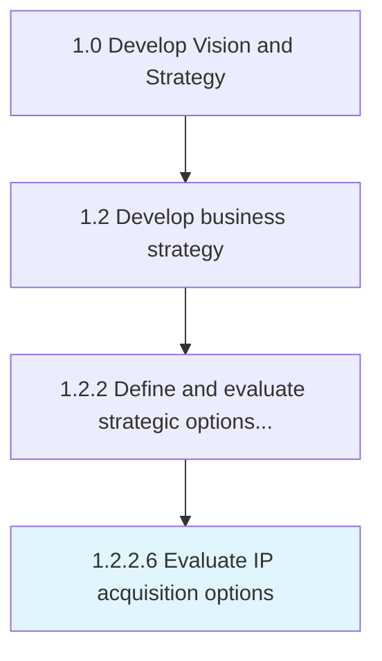

# Evaluate IP acquisition options

> Evaluating intellectual property acquisition options available to scale, modernize, and/or extend product/service reach.

## Overview

Activity 1.2.2.6 is an activity within the Develop Vision and Strategy framework. 

Evaluating intellectual property acquisition options available to scale, modernize, and/or extend product/service reach. Understand the cost, risk, timing and lifecycle value of candidate acquisitions.

## Process Hierarchy



## Key Statistics

| Metric | Value |
|--------|-------|
| APQC Code | 21609 |
| Hierarchy ID | 1.2.2.6 |
| Level | Activity |
| Parent | [1.2.2](../) |
| Sub-Processes | 0 |


## GraphDL Semantic Structure

```
evaluate.IPAcquisitionOptions
```

| Component | Value | Description |
|-----------|-------|-------------|
| Verb | `evaluate` | Primary action |
| Object | `IP acquisition options` | Direct object |


## Related Concepts

- IPAcquisitionOptions


---

*Source: APQC PCF 21609 (1.2.2.6) - APQC*
