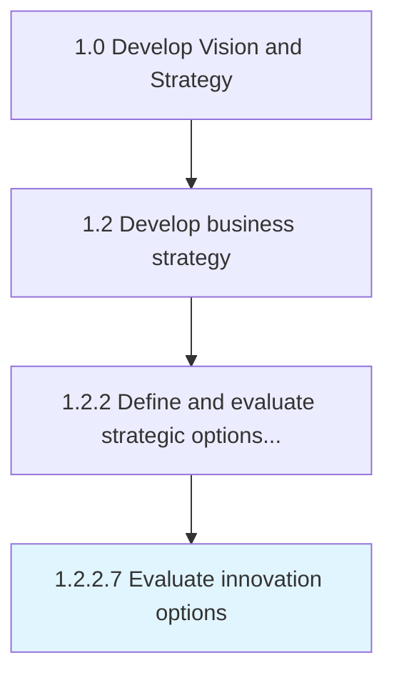

# Evaluate innovation options

> Evaluating innovation options to advance technology, products/services, and/or operational performance.

## Overview

Activity 1.2.2.7 is an activity within the Develop Vision and Strategy framework. 

Evaluating innovation options to advance technology, products/services, and/or operational performance.

## Process Hierarchy



## Key Statistics

| Metric | Value |
|--------|-------|
| APQC Code | 21610 |
| Hierarchy ID | 1.2.2.7 |
| Level | Activity |
| Parent | [1.2.2](../) |
| Sub-Processes | 0 |


## GraphDL Semantic Structure

```
evaluate.InnovationOptions
```

| Component | Value | Description |
|-----------|-------|-------------|
| Verb | `evaluate` | Primary action |
| Object | `innovation options` | Direct object |


## Related Concepts

- InnovationOptions


---

*Source: APQC PCF 21610 (1.2.2.7) - APQC*
