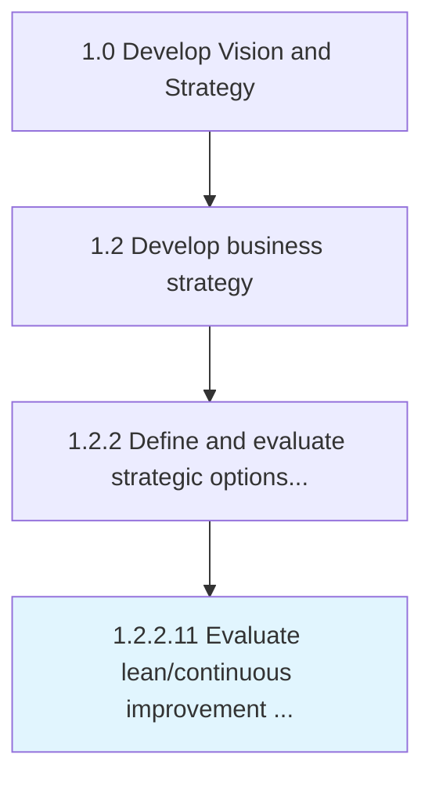

# Evaluate lean/continuous improvement options

> Evaluating options to enhance and optimize processes and functional areas.

## Overview

Activity 1.2.2.11 is an activity within the Develop Vision and Strategy framework. 

Evaluating options to enhance and optimize processes and functional areas. Understand alternatives to strengthen business capabilities, enhance process efficiencies, and advance performance standards.

## Process Hierarchy



## Key Statistics

| Metric | Value |
|--------|-------|
| APQC Code | 21614 |
| Hierarchy ID | 1.2.2.11 |
| Level | Activity |
| Parent | [1.2.2](../) |
| Sub-Processes | 0 |


## GraphDL Semantic Structure

```
evaluate.LeancontinuousImprovementOptions
```

| Component | Value | Description |
|-----------|-------|-------------|
| Verb | `evaluate` | Primary action |
| Object | `lean/continuous improvement options` | Direct object |


## Related Concepts

- [LeanImprovementOptions](/concepts/LeanImprovementOptions)
- [ContinuousImprovementOptions](/concepts/ContinuousImprovementOptions)


---

*Source: APQC PCF 21614 (1.2.2.11) - APQC*
