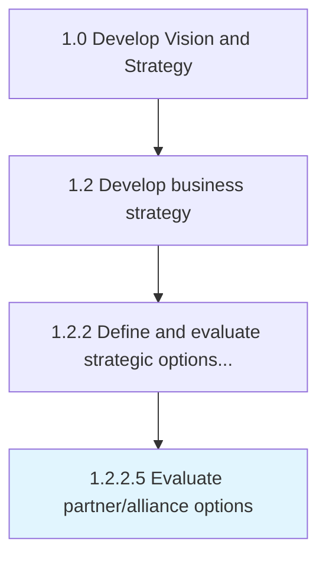

# Evaluate partner/alliance options

> Evaluating partnership and alliance opportunities to deliver products/services.

## Overview

Activity 1.2.2.5 is an activity within the Develop Vision and Strategy framework. 

Evaluating partnership and alliance opportunities to deliver products/services. Understand existing product and market models in use across the markets you serve, evolving trends, and the cost/benefit of potential new/updated partnership/alliance options.

## Process Hierarchy



## Key Statistics

| Metric | Value |
|--------|-------|
| APQC Code | 21608 |
| Hierarchy ID | 1.2.2.5 |
| Level | Activity |
| Parent | [1.2.2](../) |
| Sub-Processes | 0 |


## GraphDL Semantic Structure

```
evaluate.PartnerallianceOptions
```

| Component | Value | Description |
|-----------|-------|-------------|
| Verb | `evaluate` | Primary action |
| Object | `partner/alliance options` | Direct object |


## Related Concepts

- [PartnerOptions](/concepts/PartnerOptions)
- [AllianceOptions](/concepts/AllianceOptions)


---

*Source: APQC PCF 21608 (1.2.2.5) - APQC*
