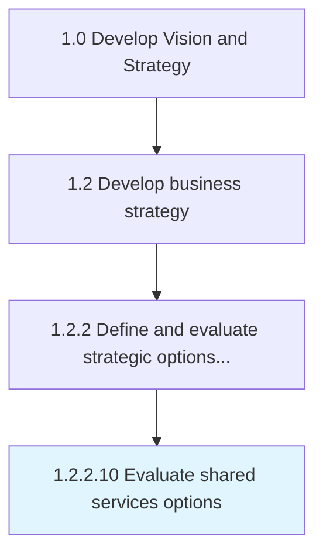

# Evaluate shared services options

> Evaluating options for shared services and support functions.

## Overview

Activity 1.2.2.10 is an activity within the Develop Vision and Strategy framework. 

Evaluating options for shared services and support functions. This should include structure, scale, adaptability to change, and alternative delivery models to balance cost, performance, and operational efficiencies.

## Process Hierarchy



## Key Statistics

| Metric | Value |
|--------|-------|
| APQC Code | 21613 |
| Hierarchy ID | 1.2.2.10 |
| Level | Activity |
| Parent | [1.2.2](../) |
| Sub-Processes | 0 |


## GraphDL Semantic Structure

```
evaluate.SharedServicesOptions
```

| Component | Value | Description |
|-----------|-------|-------------|
| Verb | `evaluate` | Primary action |
| Object | `shared services options` | Direct object |


## Related Concepts

- [SharedServicesOptions](/concepts/SharedServicesOptions)


---

*Source: APQC PCF 21613 (1.2.2.10) - APQC*
