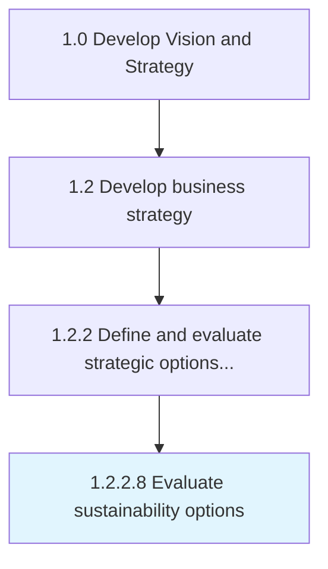

# Evaluate sustainability options

> Evaluating sustainability requirements, stakeholder expectations, and value proposition for options.

## Overview

Activity 1.2.2.8 is an activity within the Develop Vision and Strategy framework. 

Evaluating sustainability requirements, stakeholder expectations, and value proposition for options. Understand the potential activities and changes across environmental, social, and governance, the effort required, cost to implement, and benefits gained. The analysis should consider sustainable product/service lifecycles, operations, infrastructure, performance, and workforce.

## Process Hierarchy



## Key Statistics

| Metric | Value |
|--------|-------|
| APQC Code | 21611 |
| Hierarchy ID | 1.2.2.8 |
| Level | Activity |
| Parent | [1.2.2](../) |
| Sub-Processes | 0 |


## GraphDL Semantic Structure

```
evaluate.SustainabilityOptions
```

| Component | Value | Description |
|-----------|-------|-------------|
| Verb | `evaluate` | Primary action |
| Object | `sustainability options` | Direct object |


## Related Concepts

- SustainabilityOptions


---

*Source: APQC PCF 21611 (1.2.2.8) - APQC*
