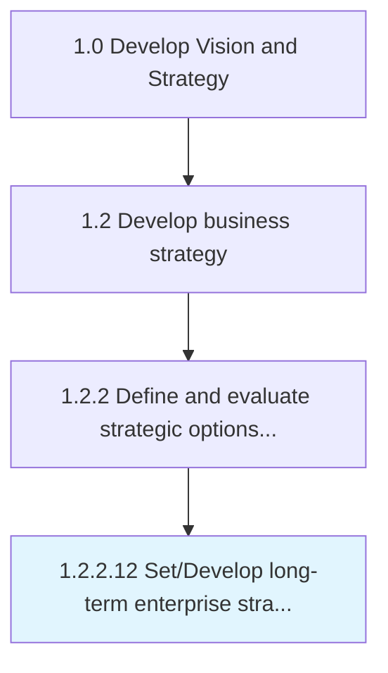

# Set/Develop long-term enterprise strategy

> Developing a strategy for the achievement of business goals over the distant future.

## Overview

Activity 1.2.2.12 is an activity within the Develop Vision and Strategy framework. 

Developing a strategy for the achievement of business goals over the distant future. Adopt one of the strategic options for realizing its mission over the long term. Enlist senior management executives, comprising strategy and/or business unit personnel.

## Process Hierarchy



## Key Statistics

| Metric | Value |
|--------|-------|
| APQC Code | 10039 |
| Hierarchy ID | 1.2.2.12 |
| Level | Activity |
| Parent | [1.2.2](../) |
| Sub-Processes | 0 |


## GraphDL Semantic Structure

```
set/develop.LongtermEnterpriseStrategy
```

| Component | Value | Description |
|-----------|-------|-------------|
| Verb | `set/develop` | Primary action |
| Object | `long-term enterprise strategy` | Direct object |


---

*Source: APQC PCF 10039 (1.2.2.12) - APQC*
