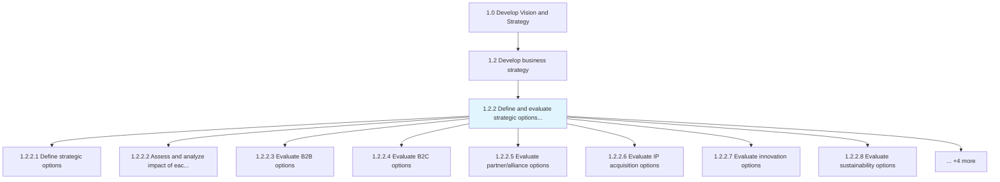
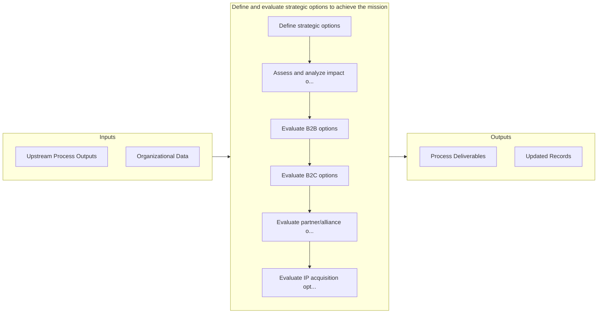

# Define and evaluate strategic options to achieve the mission

> Assessing sets of strategic decisions designed to drive the organization's long-term objectives.

## Overview

Process 1.2.2 is a core process that defines the specific procedures for define and evaluate strategic options to achieve the mission. 

Assessing sets of strategic decisions designed to drive the organization's long-term objectives. Identify various strategies concerning core functional areas. Appraise strategic options in light of auxiliary decision frameworks that ensure smooth functioning, the advancement of functional efficiencies, and vitality. Involve senior management executives, especially strategy and/or business unit personnel, with need-based consultative assistance from professional services providers.

## Process Hierarchy



## Key Statistics

| Metric | Value |
|--------|-------|
| APQC Code | 10038 |
| Hierarchy ID | 1.2.2 |
| Level | Process |
| Parent | [1.2](../) |
| Sub-Processes | 12 |


## GraphDL Semantic Structure

```
define.AndEvaluateStrategicOptions.to.AchieveTheMission
```

| Component | Value | Description |
|-----------|-------|-------------|
| Verb | `define` | Primary action |
| Object | `and evaluate strategic options` | Direct object |
| Preposition | `to` | Relationship |
| PrepObject | `achieve the mission` | Indirect object |


## Process Flow



## Sub-Processes

| Process | Hierarchy ID | Description |
|---------|-------------|-------------|
| [Define strategic options](./1.2.2.1-DefineStrategicOptions/) | 1.2.2.1 | Defining the various options available to achieve the goals highlighted in the mission statement |
| [Assess and analyze impact of each option](./1.2.2.2-AssessAnalyzeImpactEach/) | 1.2.2.2 | Scoping and probing to study the impact of strategic options for fulfilling the organization's objec |
| [Evaluate B2B options](./EvaluateB2BOptions) | 1.2.2.3 | Evaluating future business to business opportunities against past and current approaches and perform |
| [Evaluate B2C options](./EvaluateB2COptions) | 1.2.2.4 | Evaluating future business to customer opportunities against past and current approaches and perform |
| [Evaluate partner/alliance options](./EvaluatePartnerallianceOptions) | 1.2.2.5 | Evaluating partnership and alliance opportunities to deliver products/services |
| [Evaluate IP acquisition options](./EvaluateIPAcquisitionOptions) | 1.2.2.6 | Evaluating intellectual property acquisition options available to scale, modernize, and/or extend pr |
| [Evaluate innovation options](./EvaluateInnovationOptions) | 1.2.2.7 | Evaluating innovation options to advance technology, products/services, and/or operational performan |
| [Evaluate sustainability options](./EvaluateSustainabilityOptions) | 1.2.2.8 | Evaluating sustainability requirements, stakeholder expectations, and value proposition for options |
| [Evaluate global support options](./EvaluateGlobalSupportOptions) | 1.2.2.9 | Evaluating options for global support services and functions |
| [Evaluate shared services options](./EvaluateSharedServicesOptions) | 1.2.2.10 | Evaluating options for shared services and support functions |
| [Evaluate lean/continuous improvement options](./EvaluateLeancontinuousImprovementOptions) | 1.2.2.11 | Evaluating options to enhance and optimize processes and functional areas |
| [Set/Develop long-term enterprise strategy](./SetDevelopLongtermEnterpriseStrategy) | 1.2.2.12 | Developing a strategy for the achievement of business goals over the distant future |


## Related Concepts

- StrategicOptions
- AchieveMission
- StrategicOptions
- AchieveMission


---

*Source: APQC PCF 10038 (1.2.2) - APQC*
